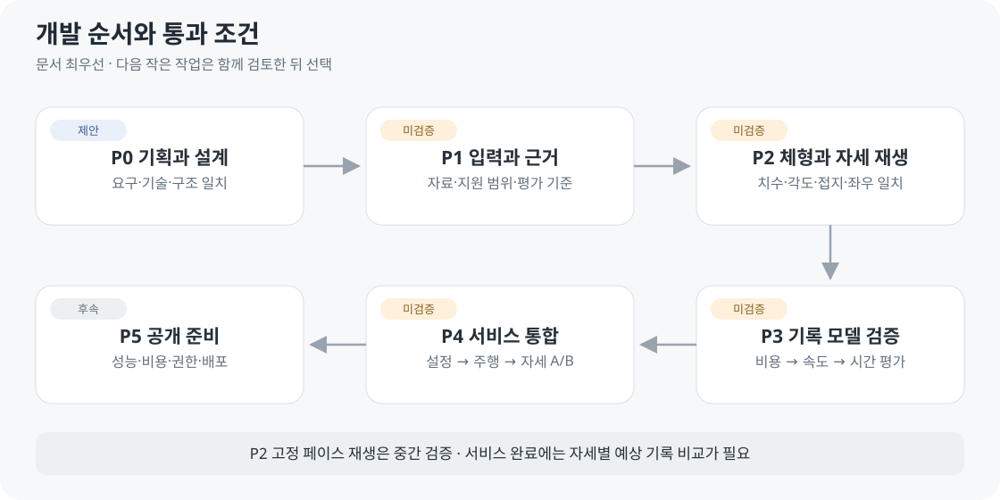

# 개발 계획과 결정 목록

2026-10-04 · v0.4 · **현재: 문서 정리 → 함께 검토 → 작은 작업 하나 선택**

| 확인 완료 | 미완료 |
| --- | --- |
| 화면 시안 · 기획/설계 초안 | 서비스 화면 · 자세 A/B |
| Blender 조절·리깅 사용자 확인 | 신체 치수와 외형/뼈대의 정확한 대응 |
| GLB · 부위 길이 6종 · 제한된 자세 8항목 · 복원 | 프레임 저장·보간 · 달리기 · 실제 코스 · 기록 계산 |
| 남성형/여성형 GLB·리깅 · 로컬 관리자·통계 | 관리자 인증 · 게시 설정 서버 검증 · 서비스 전체 통계 |

## 결정할 항목

| ID | 결정 | 근거·완료 조건 | 시점 |
| --- | --- | --- | --- |
| D01 | 최소 자세 입력 | 상체·다리·팔 후보와 실제 자료/모델 지원 대조 | P1 |
| D02 | 치수·각도·범위 | 측정점·좌표·극단값·조합·복원 · 허용 오차 고정 | P2 전 |
| D03 | 동작 생성·참고 자료 | 사용자 제작 우선 검토 · 외부 자료는 선택 · 관절/접지 검사 | P2 전 |
| D04 | 비용 모델 | 자세/속도 실측 근거 · 입력 · 재현 코드 | P3 전 |
| D05 | 능력·노력 | 정의·단위·시간 변화 · D04와 연결 검증 | P3 전 |
| D06 | 실제 코스 | 좌표·한 바퀴 길이·출발/방향·거리 오차 | 코스 재생 전 |
| D07 | 지원 거리·시간 | 자료 범위·누적 피로 근거 · 장거리 외삽 제한 | 기록 비교 전 |
| D08 | 계산 호스팅 | 시간·메모리·패키지 크기 · 운영 비용 | P5 |
| D09 | 저장 범위 | 세션 A/B 우선 · 영구 저장 권한/보관 정책 | 저장 개발 전 |
| D10 | 관리자 권한·설정 게시 | 서버 역할 검사 · 초안/게시/복원 · 변경 기록 | 운영 전 필수 |
| D11 | 서비스 통계 | 이벤트 중복 제거 · 시간대·집계·보관 · 내부 시험 제외 | 운영 전 필수 |
| D12 | 모델 유형·버전 | 남성형/여성형 로컬 검증 완료 · 저장소/게시 파이프라인 | 운영 전 필수 |

D03은 기존 ‘달리기 자료 선택’에서 ‘사용자 동작 생성·참고 자료’로 검토 범위를 변경했습니다. 외부 애니메이션을 필수로 정하지 않습니다.

| 추가 ID | 결정할 것 | 상태 |
| --- | --- | --- |
| D13 | 프레임 저장·주기·보간·녹화 의미 | M01–M05 단계 제안 · 구현 전 |
| D14 | 얼굴·가슴 등 웹 체형 입력·변형 순서 | 원본 기능 확인 · 조합 검증 전 |
| D15 | 다리 벌림·골반 너비·좌우 조절 | 요구 확인 · 범위/기본값 검토 전 |

## 다음 작은 작업 후보 · 아직 선택 전

| 후보 | 범위 | 설명 문서 |
| --- | --- | --- |
| 자세 하나 저장·복원 | 프레임 저장 가능성만 확인 | [M01](../03-screens/MOTION_EDITOR.md) |
| 얼굴 크기 하나 연결 | 원본→GLB→웹의 전달 확인 | [체형 자산](../04-technical/BODY_ASSETS.md) |
| 다리 벌림 하나 조절 | 고정 5°를 사용자 입력으로 분리 | [다리 간격](../04-technical/BODY_ASSETS.md) |

[협업 방식](WORKFLOW.md)에 따라 하나를 검토·선택한 뒤 작업합니다. 이 목록은 동시 구현 승인이 아닙니다.

## 단계별 증거

| 단계 | 통과 증거 | 요구 |
| --- | --- | --- |
| P0 | 확정/제안/미검증 구분 · 문서 충돌 제거 | 전체 |
| P1 | 이용 가능한 자료·지원 변수 · 실험 전 오차 기준 | R01·R02·R07·R08 |
| P2 | 입력/측정 치수·각도 · 접지 · 주기/속도 · 고정 페이스 시간 | R01–R05 |
| P3 | 참가자별 독립 평가 · 기준 모델 대비 오차 · 지원 범위 | R06–R08 |
| P4 | 같은 조건 A/B · A 보존 · 좌우 동기화 · 실패 처리 | R03–R08 |
| P5 | PC/브라우저 성능 · 비용 · 자료 권리 · 복구 절차 | R07·R08 |

P3가 성립하지 않으면 기록을 임의로 채우지 않고 원인·대안을 정리합니다. 개인 기록 저장은 후속으로 둘 수 있지만, R09–R11 관리자 권한·통계·모델 게시 연결은 P4–P5의 필수 완료 조건입니다.

[요구사항](../02-requirements/REQUIREMENTS.md) · [구조](../04-technical/ARCHITECTURE.md) · [검증 기록](../05-validation/CHARACTER_VALIDATION.md)