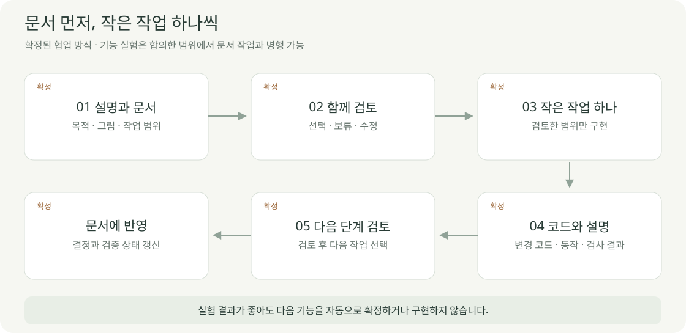

# 함께 진행하는 방식

2026-10-04 · **확정 · 문서가 최우선**

기획을 먼저 정리하고, 합의한 작은 기능 실험은 문서 작성과 병행할 수 있습니다. 실험 성공은 기능 전체의 승인·완료를 뜻하지 않습니다.

| 작업 전 | 작업 하나 | 작업 후 |
| --- | --- | --- |
| 목적·범위·선택지를 그림으로 설명 | 검토한 범위만 수정 | 변경 코드·동작·확인 결과 설명 |
| 사용자와 검토 | 필요한 검사 수행 | 문서 상태 갱신 → 다음 단계 검토 |

| 문서 표시 | 의미 |
| --- | --- |
| 확정 | 사용자와 합의한 요구·진행 방식 |
| 검토 제안 | 아직 선택하지 않은 방법·화면·기술 |
| 로컬 구현·검증 | 지정 모델·환경에서 확인한 범위 |
| 미검증·후속 | 확인하지 않았거나 아직 만들지 않은 부분 |

**작성 규칙:** 그림 먼저 → 그림당 1–2문장 → 값·범위만 짧은 표. 시안과 실제 화면을 구분합니다.

[이번 결정 기록](PROJECT.md) · [다음 작업 후보](DEVELOPMENT_PLAN.md) · [문서 시작점](../../README.md)
