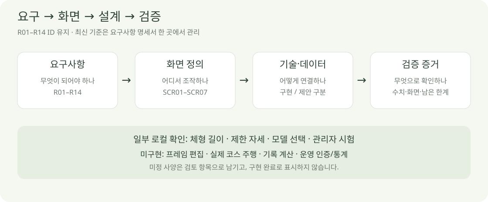

# 요구사항 명세서

2026-10-04 · v0.1 · **초안 작성 완료 / 세부 사양 검토 중**

기존 R01–R14를 유지하며 요구·검수 기준을 이 문서에서 관리합니다. ‘부분 확인’은 해당 로컬 시험만 통과했다는 뜻입니다.

## 사용자 기능

| ID · 요구 | 입력 → 동작 → 결과 | 검수 기준 | 상태 |
| --- | --- | --- | --- |
| R01 · 체형 설정 | 길이 입력 → 외형·관절 동시 변경 | 정의한 측정 길이 일치 · 다른 길이 유지 · 복원 | 6개 길이 로컬 확인 · 실제 신체 재현 미검증 |
| R02 · 자세 설정 | 허용 각도 → 지정 방향으로 관절 조절 | 목표/표시 각도 일치 · 범위 제한 · 한 주기 동작 | 정적 8항목 확인 · 한 주기 미구현 |
| R03 · 실제 트랙 | 출발·방향·목표 → 실제 좌표 위 이동 | 출처·거리 확인 · 목표 지점 도착 | 좌표·거리 미확보 |
| R04 · 좌우 동기화 | 공통 시각 → 트랙/자세 두 시점 표시 | 같은 실행·같은 시각·같은 자세 | 시안만 존재 |
| R05 · 재생 조작 | 정지·재개·배속 → 보기 시간 조절 | 좌우 함께 제어 · 계산 결과 불변 | 미구현 |
| R06 · 자세 A/B | 같은 조건·다른 자세 → 예상 기록 비교 | A 보존 · 조건 일치 검사 · 계산 근거·지원 범위 | 계산 모델 미선정 |
| R11 · 남성형/여성형 | 모델 선택 → 해당 외형·뼈대 불러오기 | 두 모델의 길이·관절 조절 검증 | 로컬 확인 · 운영 게시 전 |

## 운영·추가 기능

| ID · 요구 | 입력 → 동작 → 결과 | 검수 기준 | 상태 |
| --- | --- | --- | --- |
| R07 · 재현·검증 | 입력·버전 고정 → 동일 결과 재생성 | 자산·설정·계산 버전 보관 · 독립 자료 평가 | 로컬 검사 기록만 존재 |
| R08 · 지원 범위 | 입력·계산 검사 → 지원/실패 상태 표시 | 미지원·미완주·실패 구분 · 임의 기록 금지 | 파일/입력 일부 확인 · 실행 상태 미구현 |
| R09 · 관리자 | 모델·제한 설정 → 검증·게시·변경 기록 | 관리자 인증·서버 권한 · 사용자 제한 적용 | 로컬 작업실만 구현 |
| R10 · 이용 통계 | 확정 이벤트 → 방문·자세·체형 집계 | 중복·기간·시험 제외 · CSV · 정의 공개 | 같은 브라우저 로컬 기록만 확인 |
| R12 · 동작 제작 | 자세 저장 → 프레임 연결·반복 | 프레임 독립성 · 시작/끝/중간/경계 검사 | 사용자 제안 · 방식 검토 중 |
| R13 · 외형 조절 | 얼굴·가슴 등 입력 → 외형 변경 | 원본→웹 전달 · 길이/뼈대/자세와 조합·복원 | 요청 확인 · 범위·단위 미정 |
| R14 · 다리 간격 | 벌림 각도/골반 너비 → 간격 변경 | 정의된 방향 · 기존 자세 유지 · 겹침 검사 | 요청 확인 · 좌우·범위 미정 |

R12의 키프레임 우선 방식과 영상 녹화는 확정하지 않았습니다. R13·R14도 개별 조절 범위를 검토한 뒤 구현합니다.

## 품질·제약

| ID | 기준 | 상태·판정 |
| --- | --- | --- |
| N01 · 권한 | 운영 관리자 설정·원시 통계는 서버에서 권한 확인 | 운영 전 필수 · 로컬 개발 제한은 인증을 대신하지 않음 |
| N02 · 응답 성능 | 데스크톱 두 시점 60fps 목표 | 제안 · 기준 PC·허용 저하·측정법 미정 |
| N03 · 호환 | Windows Chromium 우선 · Mac/Safari/모바일 구분 | Windows Edge 로컬 확인 · 나머지 미검증 |
| N04 · 재현성 | 단위·관절 기준·측정 정의·자산/변형 버전 고정 | 기능별 허용 오차는 실험 전에 결정 |
| N05 · 데이터 | 개인 자료 소유 권한·통계 보관/삭제·중복 처리 | 서버 저장 도입 전 정책 검토 |
| N06 · 상태 전달 | 로딩·오류·미지원·미완료를 구분하고 이유 표시 | 입력 오류 일부 구현 · 서비스 전체 검사 전 |

주변 풍경·자세 추천·교정 점수는 제공 범위에서 제외합니다. NRC 기록 연동은 선행 조건이 아닙니다.

## 화면·증거 연결

| 화면 ID | 요구 | 설계·현재 증거 |
| --- | --- | --- |
| SCR01 · 메인 | 진입·상태 안내 | [메인 시안](../03-screens/SCREEN_SPEC.md) |
| SCR02 · 캐릭터 | R01·R02·R11·R13·R14 | [캐릭터 화면](../03-screens/CUSTOMIZATION_SCREEN.md) · [길이 검사](../05-validation/BODY_DIMENSIONS.md) |
| SCR03 · 동작 편집 | R02·R12 | [동작 편집 제안](../03-screens/MOTION_EDITOR.md) · 구현 증거 없음 |
| SCR04 · 코스 | R03·R08 | [코스 화면](../03-screens/COURSE_SCREEN.md) · 시안 |
| SCR05·06 · 주행/비교 | R04–R08 | [주행·결과 설계](../03-screens/SCREEN_SPEC.md) · 구현 증거 없음 |
| SCR07 · 관리자 | R09–R11 | [관리자](../03-screens/ADMIN_SCREEN.md) · [로컬 검사](../05-validation/reports/admin-lab-verification.json) |

미정 사항은 [D01–D15 결정 목록](../01-planning/DEVELOPMENT_PLAN.md)에서 추적합니다. 로컬 검사 수치의 허용 오차를 서비스 전체 정확도로 확대하지 않습니다.

[기획서](../01-planning/SERVICE_PLAN.md) · [기술내역서](../04-technical/TECH_SPEC.md) · [문서 목록](../README.md)
