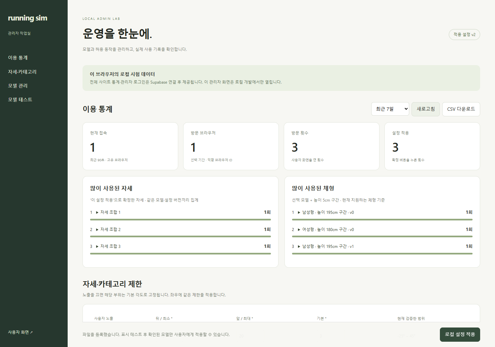
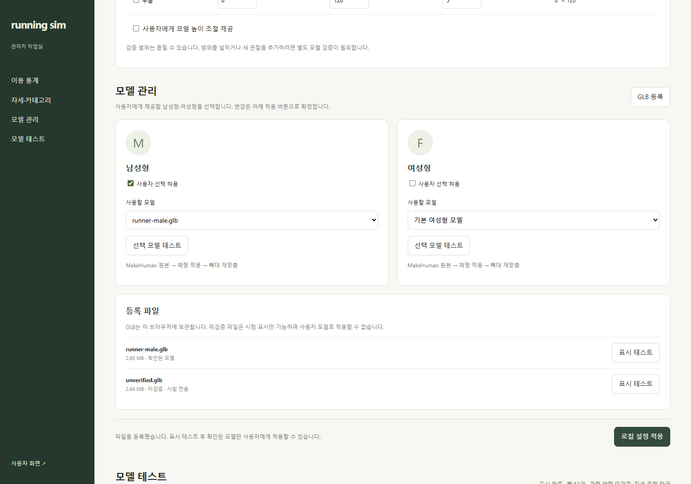
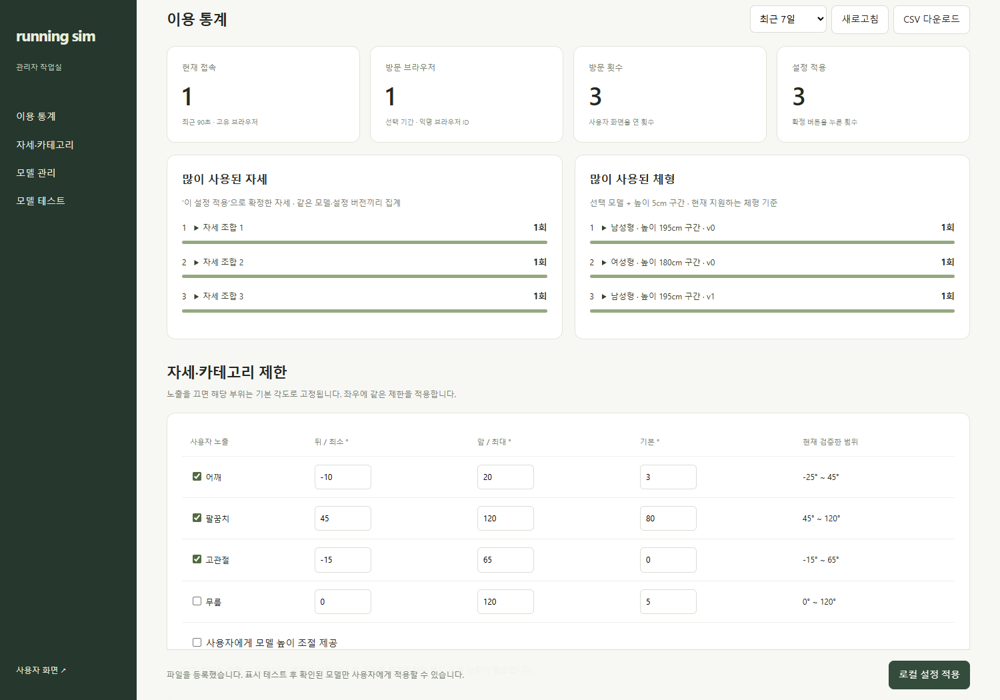

# 관리자와 사용자 설정

2026-10-04 · **로컬 관리자 구현 / 정식 관리자 인증·전체 통계는 연결 전**

화면의 수치는 자동 검증 중 발생한 로컬 사용 기록입니다. 실제 서비스 이용자 통계가 아닙니다.

## 사용자와 관리자

| 화면 | 현재 로컬 주소 | 운영 요구 |
| --- | --- | --- |
| 사용자 | http://127.0.0.1:5173/ | 게시 모델·설정 사용 · 남성형/여성형 선택 |
| 관리자 | http://127.0.0.1:5173/admin | 관리자 인증 · 모델/제한 설정 · 통계 |

현재 관리 기능은 개발 서버의 localhost에서만 동작합니다. 배포본은 관리자 기능을 차단하며, 이 제한을 운영 인증으로 대신하지 않습니다.

## 모델과 카테고리

| 기능 | 로컬 동작 | 운영 시 추가 |
| --- | --- | --- |
| 남성형·여성형 | 원본 MPFB 설정 → 체형 변경 → 뼈대 재맞춤 → 별도 GLB | 모델 파일 저장소·배포 버전 |
| 모델 변경 | 기본 모델 또는 해당 유형으로 확인된 등록 파일 선택 | 업로드→검증→게시→이전 버전 복원 |
| 미확인 GLB | 표시 시험만 허용 · 자세/사용자 적용 잠금 | 관절 대응·라이선스·동작 검사 |
| 카테고리 제한 | 어깨·팔꿈치·고관절·무릎 · 높이·6개 부위 길이 노출 | 서버에서도 허용 항목 검사 |
| 각도 제한 | 최소·최대·기본 · 검증 범위 안에서 축소 | 확대는 새 검증 버전 필요 |
| 적용 | 새로 연 사용자 화면부터 · 기존 화면 유지 | 실행마다 게시 설정 버전 고정 |

숨긴 관절은 기본 각도로 고정합니다. 모델 유형은 캐릭터 외형이며 사용자 성별·능력 추정값이 아닙니다.

부위별 길이의 노출·측정 기준은 [부위별 길이 화면](../05-validation/BODY_DIMENSIONS.md)에서 확인합니다. 길이 기록 전 이벤트는 별도 그룹으로 집계합니다.

## 각도와 노출 설정

최소 한 모델은 노출해야 합니다. 최소≤기본≤최대, 모델 유형·검증 여부를 검사하며 잘못된 설정은 저장하지 않습니다.

## 통계 정의

| 지표 | 집계 기준 |
| --- | --- |
| 현재 접속 | 최근 90초 안에 보이는 사용자 화면의 신호 · 익명 브라우저 ID 중복 제거 |
| 방문 브라우저 | 기간 내 고유 브라우저 ID · 사람 수와 구분 |
| 방문 횟수 | 사용자 화면을 연 횟수 · 새로고침 포함 |
| 많이 사용된 자세 | ‘이 설정 적용’ 이벤트 · 모델/설정 버전 + 전체 관절값 조합 |
| 많이 사용된 체형 | 적용 이벤트 · 모델/설정/변형 방식 버전 + 높이 5cm·부위 길이 1cm 반올림 구간 |
| 제외 | 관리자 방문·시험 미리보기 · 슬라이더 이동만 한 경우 |
| 조회·내보내기 | 최근 24시간/7일/30일 · 같은 기간 CSV |

로컬 보관은 최근 2,000개 이벤트입니다. 다른 브라우저·기기와 합쳐지지 않으며 저장소 삭제·비공개 창은 별도 방문으로 잡힐 수 있습니다.

## 동작 편집 도입 시 · 추가 검토

| 기존 | 추가 검토 |
| --- | --- |
| 관절별 각도·노출 제한 | 저장 프레임·중간 동작에도 동일 제한 적용 |
| 정적 자세 사용 횟수 | 동작 전체 / 프레임별 인기 지표를 구분 |
| 체형 사용 횟수 | 새 외형 항목·변형 버전 포함 여부 |

아직 통계 수집 코드를 변경하지 않았습니다. [동작 데이터 초안](../04-technical/DATA_DESIGN.md)을 먼저 검토합니다.

## 운영 연결 계약

| 대상 | 설계안 |
| --- | --- |
| 권한 | Supabase Auth 관리자 로그인 · 서버/RLS에서 관리자 역할 검사 · 사용자 역할 변경 차단 |
| 모델 | model_assets: 유형·파일·해시·관절 프로필·검증/게시 상태 |
| 설정 | configuration_versions: 초안·게시·노출·각도·모델 참조·버전 |
| 변경 기록 | admin_audit_log: 관리자·시각·전후 버전·검증 결과 |
| 이용 기록 | usage_events: 이벤트 ID·수신 시각·익명 방문 ID·모델/설정 버전·정규화 입력 |
| 수집 API | 쓰기 전용 접수 · 입력/게시 버전 검사 · 이벤트 ID 중복 제거 · 요청량 제한 |
| 통계 조회 | 관리자만 집계 조회 · 일반 사용자는 원시 이용 기록 열람 불가 |
| 운영 전 확정 | 방문 정의·집계 시간대·봇/내부 트래픽 제외·보관/삭제 기간·동시 접속 검증 |

관리자 인증·서버 통계는 정식 운영 전 필수입니다. 일반 사용자의 계정·개인 기록 저장은 별도 범위입니다.

[검증 결과](../05-validation/reports/admin-lab-verification.json) · [남성형 변환](../../experiments/model-preview/public/models/runner-male.export.json) · [여성형 변환](../../experiments/model-preview/public/models/runner-female.export.json) · [전체 아키텍처](../04-technical/ARCHITECTURE.md)
