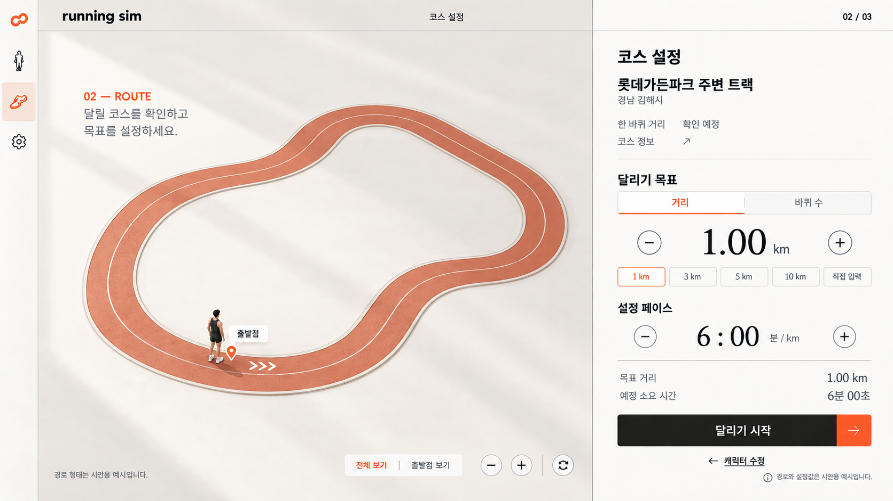
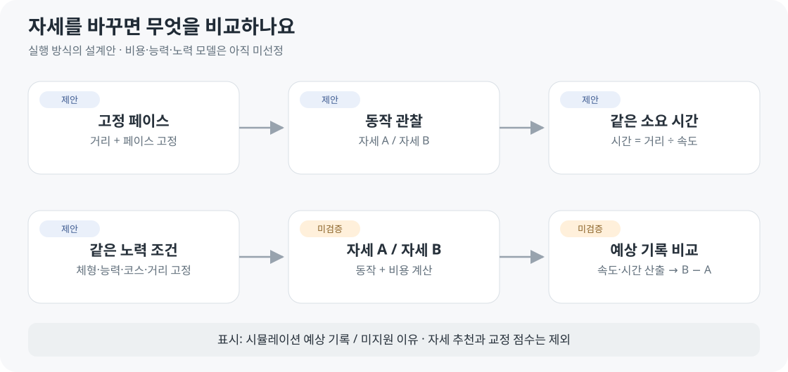

# 코스와 실행 조건

2026-10-04 · v0.3 설계안 · **실제 트랙과 목표를 정한 뒤 실행**

정적 시안 v1. 실제 트랙 형상·거리와 새 실행 방식은 반영 전입니다.

| 영역 | 구성 |
| --- | --- |
| 왼쪽 | 트랙 · 출발점 · 진행 방향 |
| 오른쪽 | 목표 거리/바퀴 · 실행 방식 · 조건 · 시작 |
| 첫 코스 | 김해 롯데가든파크 주변 트랙 · 좌표/길이 확인 전 |
| 배경 | 주변 풍경 제외 |

## 실행 방식

| 설정 | 고정 페이스 | 같은 노력 조건 |
| --- | --- | --- |
| 목표 | 양수 거리/바퀴 | 모델 지원 거리/시간 안에서 |
| 입력 | 분/km · 0보다 큰 값 · 초 0–59 | 능력·노력 정의 확정 후 제공 |
| 시작 전 | 설정 페이스 기준 소요 시간 | 준비 상태 · 계산 전 기록 표시 없음 |
| 시작 후 | 실행 자료 준비 → 재생 | 계산 중 → 결과 준비 → 재생 |
| 비교 | 같은 거리·페이스는 같은 시간 | 자세 A/B 예상 기록 |

실제 경로·한 바퀴 길이 미확인, 입력 오류, 모델 미지원이면 이유를 표시하고 시작을 막습니다.

## 조건 유지

| 행동 | 규칙 |
| --- | --- |
| 바퀴 목표 | 검증한 한 바퀴 길이로 거리 계산 |
| 캐릭터 수정 | 코스·목표·실행 조건 유지 |
| B 실행 | A의 체형·능력·노력·코스·거리·환경·버전 유지 |
| 계산 실패 | A 보존 · 이전 결과를 새 결과로 표시하지 않음 |

[캐릭터 설정](CUSTOMIZATION_SCREEN.md) · [전체 화면](SCREEN_SPEC.md) · [코스 결정 D06](../01-planning/DEVELOPMENT_PLAN.md)