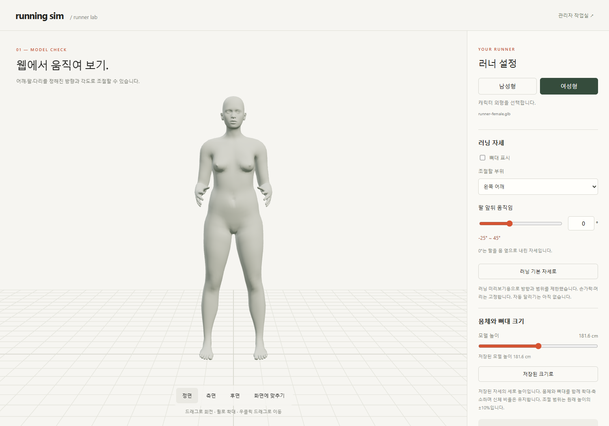

# 캐릭터 설정 화면

2026-10-04 · v0.4 설계안·로컬 구현 구분 · **전신을 보면서 체형과 필요한 자세만 조절**

정적 시안 v7. ‘나의 러너’ 제목 제거, 안내·작은 사람 도식은 BODY 아래에 배치합니다. 치수·복장·외형은 예시이며 자세 편집은 반영 전입니다.

## 배치

남성형·여성형을 별도 GLB로 선택합니다. 각 모델은 MPFB 체형 적용 후 뼈대를 다시 맞췄으며, 관리자에서 유형별 노출·사용 모델을 관리합니다. 사용자 성별·능력 추정과는 무관합니다.

| 왼쪽 약 65% | 오른쪽 약 35% |
| --- | --- |
| 머리부터 발끝까지 전신 | BODY / 자세 구분 |
| 앞·옆·뒤 · 드래그 회전 | 선택한 한 항목 집중 편집 |
| 기준점·높이 눈금 제안 | 값·단위·의미·지원 범위 |
| 기본값·시점 복원 | 이 캐릭터로 시작 → 코스 |

기본값 그대로 확정할 수 있습니다. 설정 확정만으로 코스 주행을 시작하지 않습니다.

## 현재 길이 조절

외형과 뼈대를 함께 바꾸며 기존 자세를 유지합니다. 전체 높이는 부위 길이에 따라 달라집니다. [상세 기준](../05-validation/BODY_DIMENSIONS.md)

## 외형·자세·동작의 구분

얼굴 크기·가슴 크기 등은 [원본 체형 기능](../04-technical/BODY_ASSETS.md)을 웹에 연결하는 검토 항목입니다. 다리 간격은 골반 너비와 다리 벌림으로 구분하며 아직 입력을 제공하지 않습니다.

[사용자 동작 편집](MOTION_EDITOR.md)은 현재 자세를 프레임으로 저장하는 추가 화면 제안입니다.

## 입력·후속 후보

현재 [로컬 시험](../06-guides/MODEL_PREVIEW.md)은 좌우 어깨·팔꿈치·고관절·무릎의 방향·각도를 제한합니다. 손가락·머리와 자유 X/Y/Z 회전은 노출하지 않습니다.

| 체형 후보 | 단위·기준 | 상태 |
| --- | --- | --- |
| 키 | cm · 발바닥→머리 | 기준 자세·범위 검증 전 |
| 위팔·아래팔·허벅지·종아리·몸통 | cm · 관절 중심 기준 | [로컬 구현·측정 기준](../05-validation/BODY_DIMENSIONS.md) |
| 어깨너비 | cm · 좌우 어깨 관절 중심 | 로컬 구현 · 기본 길이 ±15% |
| 얼굴·가슴 크기 | 원본 변형값 · cm/실측 기준 미정 | 요청 반영 · 웹 연결 전 |
| 다리 간격 | 벌림 각도 / 골반 너비 | 현재 바깥 5° 고정 · 조절 범위 미정 |
| 발 크기 | mm · 발뒤꿈치→발끝 | 맨발/신발 기준 미정 |
| 몸무게 | kg · 질량 | 외형 대응 미정 · 체력 자동 추정 없음 |

무릎·발목은 동작과 접지에 연동하는 제안입니다. 최종 항목·범위는 [D01–D03](../01-planning/DEVELOPMENT_PLAN.md)의 검증 후 확정합니다.

## 편집 규칙 · 서비스 설계 제안

| 행동·상태 | 반영 |
| --- | --- |
| 유효한 입력 | 즉시 미리보기 · 숫자/눈금 일치 |
| 빈칸·범위 밖·불가능한 조합 | 마지막 유효 외형 유지 · 이유 표시 · 다음 단계 차단 |
| 로딩 실패 | 재시도 · 입력 초안 유지 |
| 설정 확정 | 치수·자세·모델 버전 보관 → 코스 |
| 재편집 취소 | 이전 확정값·주행 조건 유지 |
| 재편집 적용 | 새 설정 확정 → 코스 · 자동 재시작 없음 |
| A에서 자세 변경 | B 초안 생성 · A 덮어쓰기 없음 |

변경값을 몰래 보정하지 않습니다. 편집 초안과 확정값을 구분하며 초기 세션은 새로고침 복구를 보장하지 않습니다.

현재 로컬 시험은 범위 밖 각도·길이를 제한값으로 보정하고 안내합니다. 위 표의 초안·취소·코스 이동은 아직 구현 전입니다.

## 완료 증거

| 외형 | 동작 | 화면 |
| --- | --- | --- |
| 입력/측정 치수 일치 | 목표/실제 각도 일치 | 앞·옆·뒤 · 복원 |
| 전신 잘림 없음 | 관절 정렬·접지 | 오류·취소·재편집 일관성 |

[검증 계획](../05-validation/CHARACTER_VALIDATION.md) · [전체 화면](SCREEN_SPEC.md) · [코스](COURSE_SCREEN.md)

이전 시안: [v1](../assets/images/archive/character-customization-v1.png) · [v2](../assets/images/archive/character-customization-v2.png) · [v3](../assets/images/archive/character-customization-v3.png) · [v4](../assets/images/archive/character-customization-v4.png) · [v5](../assets/images/archive/character-customization-v5.png) · [v6](../assets/images/archive/character-customization-v6.png)
