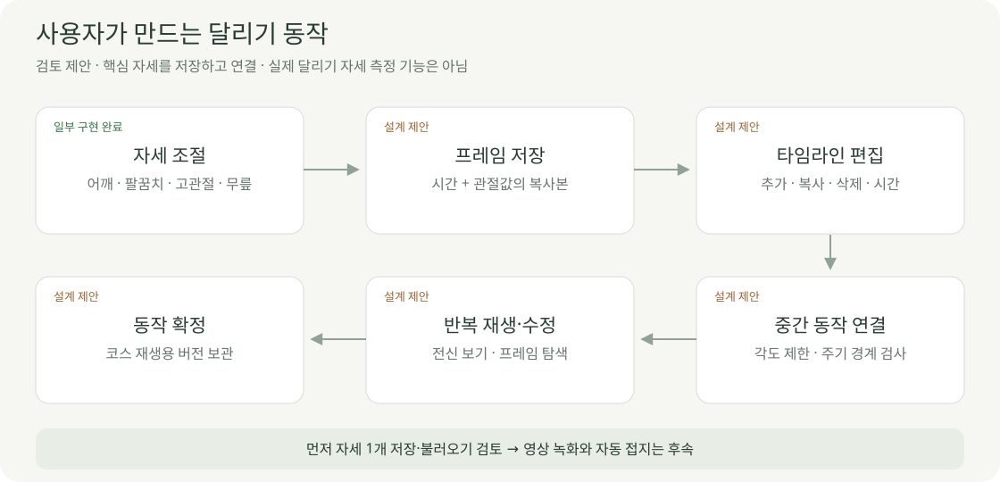

# 사용자 동작 편집 기획

2026-10-04 · **사용자 제안 구체화 · 화면·저장·재생 모두 미구현**

사용자가 만든 자세들을 시간 순서로 연결합니다. 외부 달리기 애니메이션은 필수 전제로 두지 않는 방향을 검토합니다.

## 화면 제안

기존 캐릭터 편집 영역에 타임라인을 추가하는 제안입니다. 그림의 **4개 프레임·각도·시간은 예시**이며 확정 기본값이 아닙니다.

| 조작 | 제안 동작 |
| --- | --- |
| 현재 자세 저장 | 해당 시각의 관절값을 독립 복사본으로 저장 |
| 프레임 선택 | 선택한 관절값으로 캐릭터 표시 |
| 수정·복사·삭제 | 선택 프레임만 변경 · 되돌리기 검토 |
| 시간 이동 | 순서·중복 시각 검사 후 배치 |
| 재생·정지·시점 탐색 | 저장한 프레임 사이를 연결해서 표시 |
| 동작 확정 | 모델·체형·관절 제한·프레임 버전 함께 고정 |

## ‘녹화’의 세 가지 의미

| 방식 | 남기는 것 | 우선순위 제안 |
| --- | --- | --- |
| 자세를 프레임으로 저장 | 시각 + 관절값 | 먼저 검토 |
| 슬라이더 조작 과정 기록 | 시간별 입력 변화 | 후속 · 불필요한 움직임 정리 필요 |
| 재생 영상 저장 | 동영상 파일 | 후속 · 파일 형식·브라우저 확인 필요 |

프레임은 자세 분석·재편집에 쓰고, 영상은 보여주기에 씁니다. 사용자가 만든 캐릭터 자세이며 실제 사용자의 달리기를 측정한 자료는 아닙니다.

## 작은 작업 후보

| 순서 | 작업 하나 | 완료 증거 |
| --- | --- | --- |
| M01 | 현재 자세 1개 저장·불러오기 | 다른 자세로 바꾼 뒤 저장값 복원 |
| M02 | 프레임 2개와 시각 관리 | 한 프레임 수정이 다른 프레임에 영향 없음 |
| M03 | 두 자세 사이 재생 | 시작·끝 일치 · 중간 각도 제한 유지 |
| M04 | 한 주기 반복 | 마지막→처음 경계·속도 변화 검사 |
| M05 | 코스 주행 연결 | 경로 이동과 두 시점의 공통 시간 일치 |

각 작업은 별도 설명·검토 후 시작합니다. 프레임 개수, 연결 방식, 주기 길이, 좌우 복사, 저장 위치는 미정입니다.

| 먼저 검토할 문제 | 처리 방향 제안 |
| --- | --- |
| 다리 간격 | 벌림 각도와 골반 너비 분리 · 현재 좌우 각각 바깥 5° 고정 |
| 중간 자세 | 프레임 양 끝뿐 아니라 중간값·관통 검사 |
| 발 접지 | 보간만으로 해결되지 않음 · 접지 방식 별도 선정 |
| 체형·모델 변경 | 기존 프레임 호환 재검사 · 조용히 덮어쓰지 않기 |
| 기록 차이 | 재생 가능한 동작과 기록 계산 지원 여부를 분리 |

[데이터 초안](../04-technical/DATA_DESIGN.md) · [화면정의](SCREEN_SPEC.md) · [협업 방식](../01-planning/WORKFLOW.md)
