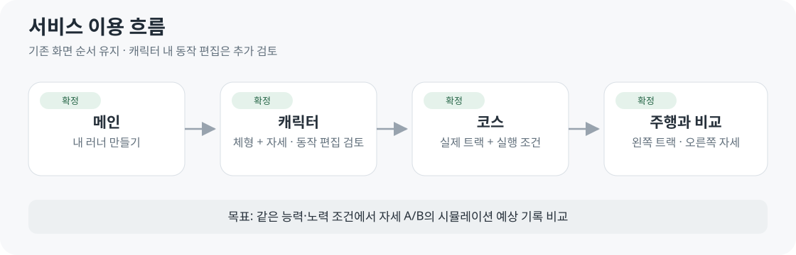
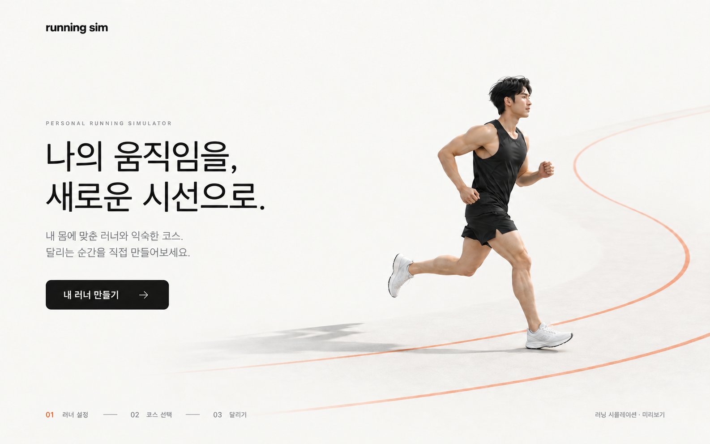
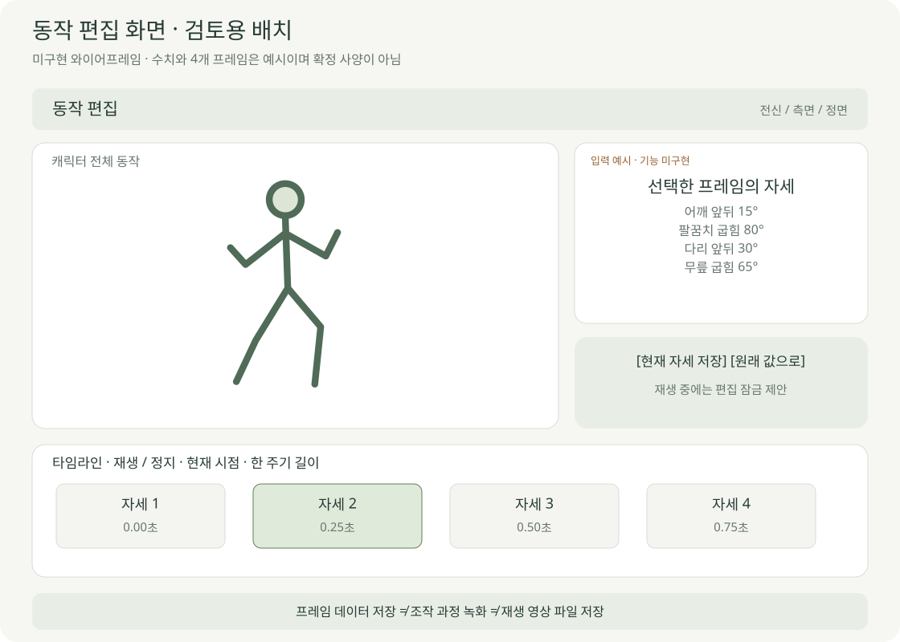
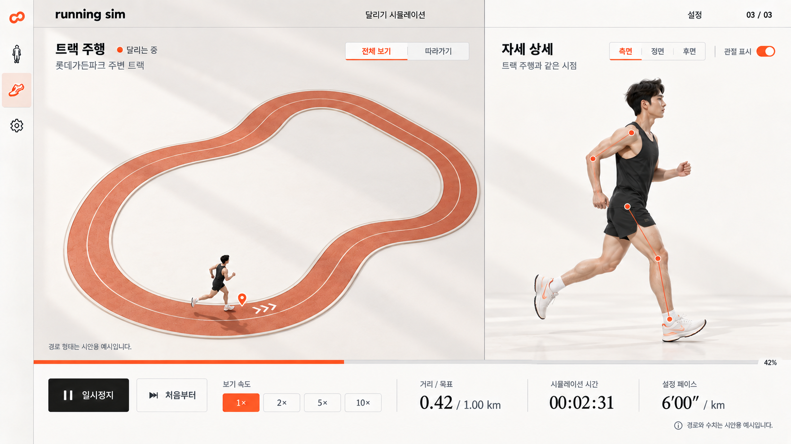
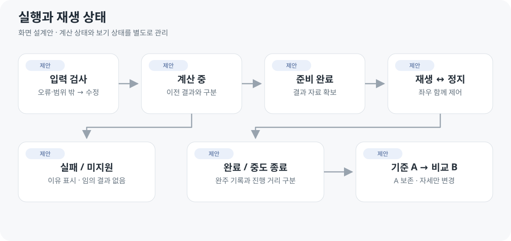

# 화면정의서

2026-10-04 · v0.4 설계안 · **메인 → 캐릭터 → 코스 → 좌우 주행**

## 화면 목록과 요구사항 연결

| ID | 화면 | 요구 | 상태 |
| --- | --- | --- | --- |
| SCR01 | 메인 | 진입·안내 | 정적 시안 |
| SCR02 | 캐릭터 설정 | R01·R02·R11·R13·R14 | 길이·제한 자세 시험 · 외형 확장 전 |
| SCR03 | 동작 편집 | R02·R12 | 배치 제안 · 미구현 |
| SCR04 | 코스 설정 | R03·R08 | 시안 · 실제 좌표 미확보 |
| SCR05 | 좌우 주행 | R04·R05·R08 | 시안 · 미구현 |
| SCR06 | A/B 결과 영역 | R06·R07·R08 | 주행 화면 내부 영역 제안 |
| SCR07 | 관리자 | R09–R11 | 로컬 시험 · 운영 인증 전 |

[요구사항별 검수 기준](../02-requirements/REQUIREMENTS.md). 화면 ID는 경로와 별개이며 SCR03·SCR06은 독립 페이지로 확정하지 않았습니다.

## 메인

정적 시안 v3. 시작 행동은 ‘내 러너 만들기’입니다.

| 경로 제안 | 화면 | 핵심 행동 |
| --- | --- | --- |
| / | 메인 | 내 러너 만들기 |
| /runner | [캐릭터](CUSTOMIZATION_SCREEN.md) | 체형·자세 확인 → 확정 · 동작 편집 통합 제안 |
| /course | [코스](COURSE_SCREEN.md) | 경로·목표·실행 조건 → 시작 |
| /run | 주행·결과 | 공통 재생 → 기준 A 보관 → B 비교 |
| /admin | [관리자](ADMIN_SCREEN.md) | 모델 시험·변경 · 각도/카테고리 제한 · 이용 통계 |

위 경로는 서비스 설계안입니다. 현재 로컬 `/`는 메인이 아닌 모델 시험 화면이고 `/admin`만 관리자 시험으로 동작합니다.

사용자 캐릭터 화면에 남성형·여성형 모델 선택을 제공합니다. 관리자 화면은 로컬 시험만 구현했으며 운영 인증·통계 연결 전입니다.

준비되지 않은 주행 주소로 진입하면 필요한 설정 단계로 안내합니다.

## 동작 편집 · 추가 배치 제안

캐릭터 설정 내부에서 자세 저장·프레임 편집을 제공하는 제안입니다. 별도 페이지 분리는 미정이며, [작업별 화면 규칙](MOTION_EDITOR.md)을 먼저 검토합니다.

## 주행

정적 시안 v2. 실제 경로·새 자세 입력·A/B 결과는 반영 전입니다.

| 왼쪽 약 60% | 오른쪽 약 40% | 공통 |
| --- | --- | --- |
| 실제 트랙 · 출발·방향 | 동일 시점 전신 자세 | 시간·거리·페이스·바퀴 |
| 따라가기 / 전체 보기 | 측면 기본 · 정면/후면 | 정지·재개·처음·보기 배속 |
| 주변 풍경 제외 | 검증된 각도만 수치 표시 | 실행 방식·A/B·상태 |

1440×900 데스크톱 기준안입니다. 카메라·보기 배속은 계산 결과에 영향을 주지 않습니다.

## 상태와 비교

| 상황 | 화면 규칙 |
| --- | --- |
| 로딩·잘못된 입력 | 이유 표시 · 시작 비활성 |
| 계산 중 | 접수/진행 표시 · 이전 결과 재사용 표시 금지 |
| 탭 숨김 | 보기 재생 정지 · 복귀 후 수동 재개 제안 |
| 설정 변경 | 현재 실행 종료 후 새 실행 · A 유지 |
| 미지원·실패 | 이유·수정/재시도 · 0초로 대체하지 않음 |
| 초기 세션 | 새로고침 복구 보장 안 함 · 영구 저장 후속 |

| A/B 결과 영역 | 표시 |
| --- | --- |
| 공통 조건 | 체형·능력·노력·코스·거리·환경·모델/자산 버전 |
| 변경 항목 | 자세 A / B 값·단위 |
| 결과 | 시뮬레이션 예상 기록 · B − A · 적용 범위/검증 오차 |
| 재생 | A/B 선택 → 기존 좌우 화면 · 기준 A 보존 |
| 비교 제한 | 자세 외 조건 불일치 · 계산 미지원 · 미완주 |

추천·최적 자세 배지는 제공하지 않습니다. 화면 완료 기준은 [R01–R14](../02-requirements/REQUIREMENTS.md)를 따르며, R12–R14의 세부 방식은 검토 중입니다.
