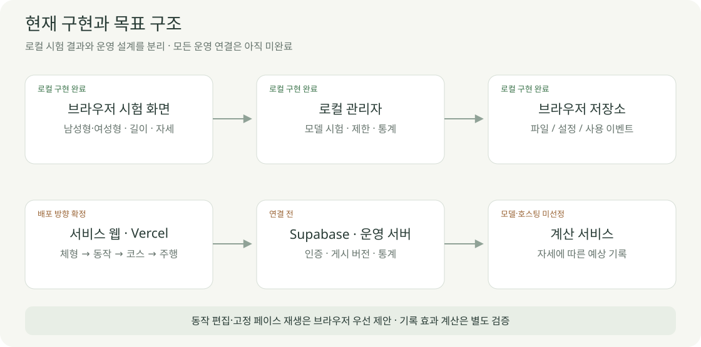
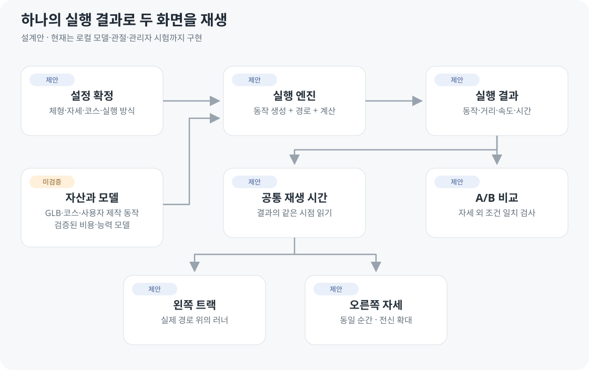
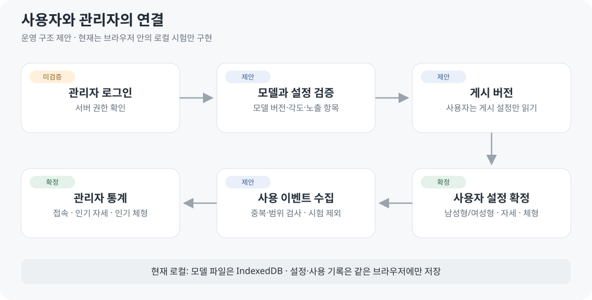
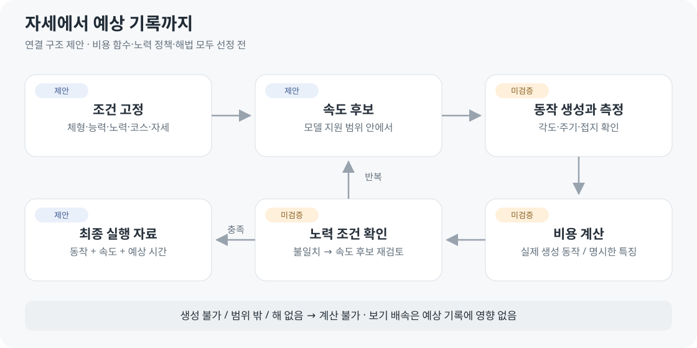

# 아키텍처 설계

2026-10-04 · v0.4 설계안 · **설정 하나 → 실행 결과 하나 → 공통 시간으로 두 화면**

현재 구현은 로컬 모델·제한된 자세·관리자 설정·로컬 통계 시험입니다. 기록 계산 API는 검증 후 연결하며, 관리자 인증·서비스 통계 저장은 정식 운영 전에 연결합니다.

## 관리와 이용 데이터

현재 관리자 설정은 같은 브라우저에만 적용됩니다. [운영 계약](../03-screens/ADMIN_SCREEN.md)은 관리자 권한, 모델/설정 게시 버전, 감사 기록, 이벤트 접수·중복 제거·집계를 분리합니다. 일반 사용자는 게시 설정만 읽고 원시 이용 기록은 조회할 수 없습니다.

## 편집 데이터의 연결 · 제안

현재 자세를 프레임으로 저장하고, 확정한 동작을 실행 입력에 연결하는 구조입니다. [데이터 초안](DATA_DESIGN.md)은 기존 실행 계약을 보완하며 아직 서버 스키마로 구현하지 않았습니다.

## 동작과 기록의 연결

고정 페이스 모드는 비용 모델 없이 거리 ÷ 속도로 시간을 구합니다. 같은 노력 모드의 계산식·해법은 미선정입니다.

## 데이터 계약

아래는 구현 전 계약 초안입니다. 공통 Schema/OpenAPI로 고정할 예정입니다.

| 데이터 | 필수 내용 |
| --- | --- |
| BodyProfile | m·kg 치수 · 측정 정의 · 외형/뼈대 변환 버전 |
| PoseProfile | rad 각도 · 기준축·좌표계 버전 |
| PoseFrame / MotionClip | 시각·관절값 / 프레임 묶음·주기·보간·체형·제한 버전 · 상세는 데이터 초안 |
| CourseAsset | 미터 좌표·구간 길이 · 출발/방향 · 출처/원본 좌표계 · 고도 상태 · 해시/버전 |
| CapacityProfile | 모델별 능력 변수·단위·출처·보정 버전 — 세부 미정 |
| Scenario | 입력 고정 복사본 · 방식·목표 · 자산/모델 버전 · 필요 시 시드 |
| ModelManifest | 지원 체형/자세/속도/경사/시간 · 출력 · 검증 버전·제한 |
| MotionArtifact | 실제 동작 · 시간/주기 · 관절 대응/접지 · 단위/좌표계/해시 |
| RunResult | 입력 ID · 상태 · 동작 참조 · 시간/거리/속도 · 예상 기록 · 버전 |

| 방식 | 필수 입력 | 산출 |
| --- | --- | --- |
| fixed_pace | paceSecPerKm · 거리 | 소요 시간 · effortPolicy 사용 안 함 |
| fixed_effort | capacityProfile · effortPolicy · 거리 | 속도·페이스·예상 시간 |
| 결과 상태 | complete / incomplete / unsupported / failed | 없는 값은 null + 이유 |

## 좌표와 재생

| 기준 | 규칙 |
| --- | --- |
| 계산 단위 | m · kg · s · rad · UI 경계에서만 변환 |
| 실제 경로 | 위경도 원본 보존 → 로컬 미터 좌표 → 누적 구간 길이 |
| 인체 좌표 | Y-up · 모델 전방/관절축 대응표 · X/Y/Z ≠ 해부학 각도 |
| 이동 | 속도 × 시간 누적 → 경로 위치 · 점 개수로 속도 결정 안 함 |
| 주기 | 한 걸음 길이 × steps/min ÷ 60 = m/s · 양발 한 주기와 구분 |
| 좌우 | 같은 결과 시점 · 오른쪽은 위치만 중앙 고정 |
| 보기 배속·정지 | 결과 불변 · 숨긴 탭의 보기 재생은 정지 제안 |
| A/B | 자세 외 조건 동일 · A 보존 · 같은 절대 시간 기준 |
| 먼저 끝난 실행 | 완료 상태 유지 · 같은 진행률 비교와 구분 |

시각 보정 후에도 분석 각도와 화면 각도의 차이를 검사합니다. 시각 지원 항목과 모델의 supportedPoseKeys는 구분합니다.

## 검증 흐름

원시 모션캡처·지면 반력·근전도와 OpenSim 추정 힘을 구분합니다. [자료 후보](../07-references/REFERENCES.md#posture-dataset)의 제공 항목만으로 기록 예측 전체가 검증되지는 않습니다.

## API와 저장 확장

| 제안 API | 계약 |
| --- | --- |
| POST /simulations | 접수 202 + 실행 ID / 잘못된 입력 422 |
| GET /simulations/{id} | queued / running / complete / failed |
| GET /simulations/{id}/result | 완료된 결과·동작 참조만 반환 |

계산 상태와 playing/paused는 별개입니다. 고정 페이스 로컬 실행과 후속 Python API는 같은 입력·결과 계약을 사용합니다.

| 후속 저장 | 내용 |
| --- | --- |
| DB runner_profiles | 소유자별 체형·자세 프리셋 |
| DB simulation_runs | 입력·상태·버전·요약·동작 참조 |
| Storage | 큰 동작/시간별 파일 · 해시·단위·버전 |

저장 전 결정: 사용자 권한·공개 자산 분리·중복 요청·재시도·보관/삭제 정책. 초기 세션은 새로고침 복구를 보장하지 않습니다.

## 코드 배치 제안

| 경로 | 책임 |
| --- | --- |
| apps/web | 설정·동작 편집·3D·공통 재생·A/B |
| packages/contracts | 단위·검사·입출력 계약 |
| packages/simulation | 고정 페이스·경로·시간 |
| services/simulation | 검증 후 Python 계산/API |
| research | 자료 정리·보정·독립 평가 |
| experiments/model-preview | 현재 GLB 전달 시험 |

위 새 디렉터리는 아직 생성하지 않았습니다. [개발 순서](../01-planning/DEVELOPMENT_PLAN.md) · [기술 선택](TECH_SPEC.md)