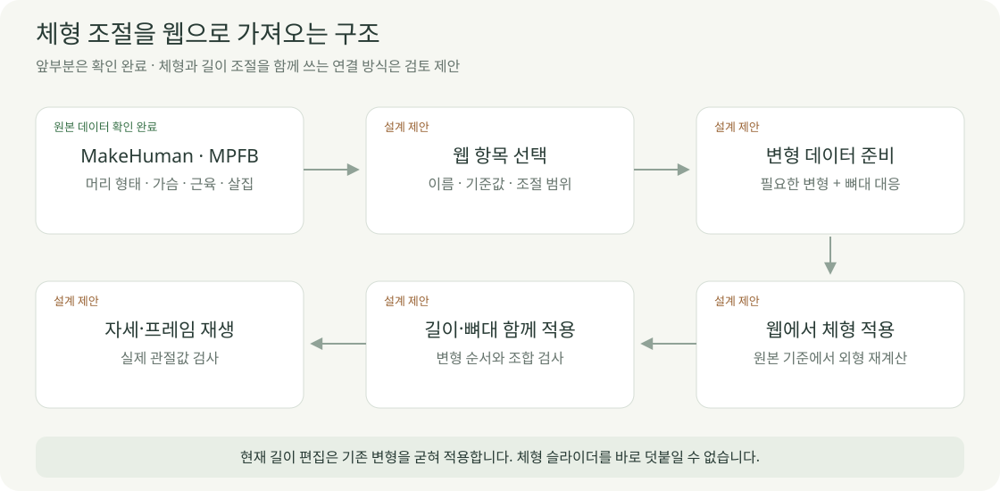

# 외형·길이·자세의 연결

2026-10-04 · **원본 기능 확인 / 웹 체형 편집 연결은 검토 제안**

MakeHuman·MPFB의 조절 기능이 GLB에 모두 자동 포함되는 것은 아닙니다. 웹에서 사용할 항목과 변형 데이터를 먼저 정해야 합니다.

| 구분 | 항목 | 현재 상태 |
| --- | --- | --- |
| 외형 | 머리·얼굴 크기/형태 · 가슴 · 근육·살집 | 원본 데이터 확인 · 웹 입력 미연결 |
| 길이 | 위팔·아래팔·허벅지·종아리·몸통·어깨너비 | [로컬 구현·검사](../05-validation/BODY_DIMENSIONS.md) |
| 자세 | 어깨·팔꿈치·고관절·무릎 | 제한된 방향·각도 로컬 구현 |
| 다리 간격 | 골반 너비 / 다리 벌림 | 별도 입력 없음 · 분리 설계 필요 |

## 지금 화면에서 되는 것

현재 길이 변경은 기본 외형을 늘리고 뼈대를 다시 맞춥니다. 기존 변형 데이터는 외형에 굳혀 적용하므로 **체형과 길이 편집을 조합할 구조는 추가 설계가 필요합니다.**

| 검토 후보 | 먼저 정할 기준 |
| --- | --- |
| 얼굴 크기 | 머리 전체 / 얼굴 영역 구분 · 목 연결과 눈·치아 등 부속 형상 |
| 가슴 크기 | 볼륨 조절 기준 · 체형과의 조합 · 의류 대응 |
| 근육·살집 | 시각적 조절값 · 실제 kg/체력과 구분 |
| 다리 벌림 | 좌우 공통/개별 · 안쪽/바깥쪽 범위 · 관통 확인 |
| 골반 너비 | 고관절 중심 간 거리 / 겉면 너비 구분 |

체형 편집 순서의 제안: **원본 → 외형 변형 → 길이·뼈대 → 자세**. 순서별 결과·복원·조합을 확인한 뒤 확정합니다.

## 작은 검증 제안

| 후보 | 범위 | 확인 |
| --- | --- | --- |
| 얼굴 크기 하나 | 원본 변형 → 필요한 데이터만 GLB → 웹 입력 | 목·부속 형상·복원·길이 변경과 호환 |
| 다리 벌림 하나 | 현재 고정값을 입력으로 분리 | 앞뒤 각도·무릎 굽힘 유지·겹침 |

둘 다 아직 작업 승인 전입니다. 먼저 할 항목을 함께 검토합니다.

| 확인 근거 | 위치 |
| --- | --- |
| 원본 변형 자료 | `data/raw/makehuman/mpfb-2.0.17/data/targets/head/` · `breast/` · Git 제외 |
| 남성형·여성형 내보내기 | [변환 코드](../../experiments/model-preview/export_variants.py) · [모델 기록](../../experiments/model-preview/public/models/runner-male.export.json) |
| 현재 길이 변형 | [body-dimensions.ts](../../experiments/model-preview/src/body-dimensions.ts) |
| 현재 다리 벌림 고정 | [running-pose.ts](../../experiments/model-preview/src/running-pose.ts) |

[사용자 설정 화면](../03-screens/CUSTOMIZATION_SCREEN.md) · [검증 기록](../05-validation/CHARACTER_VALIDATION.md) · [자산 출처](../07-references/makehuman-assets.json)
