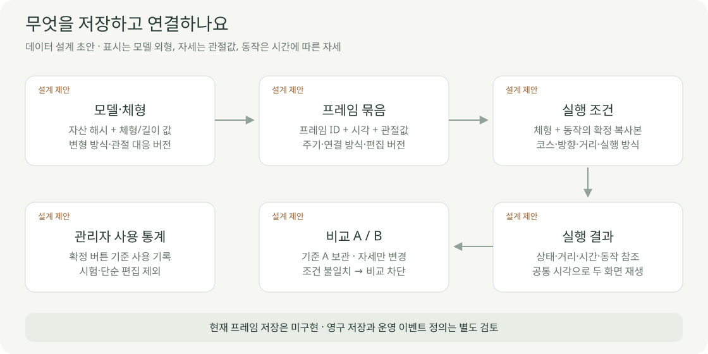

# 데이터 설계 초안

2026-10-04 · **검토 제안 · 서버 테이블·프레임 저장은 미구현**

편집 중인 값과 확정한 실행 입력을 분리합니다. 저장 형식·테이블 이름·API는 구현 전에 함께 검토합니다.

| 데이터 | 최소 내용 제안 | 변경 규칙 |
| --- | --- | --- |
| BodyProfile | 모델 해시·유형 · 길이 · 외형값 · 측정/변형 버전 | cm 입력과 내부 m 구분 · 외형값 단위 미정 |
| PoseFrame | 프레임 ID · 시각(s) · 관절값(rad) · 관절 정의 버전 | 선택 프레임만 수정 · 참조 공유 금지 |
| MotionDraft | 체형 참조 · 프레임 목록 · 주기(s) · 연결 방식 | 편집용 · 결과 재현 보장 전 |
| MotionClip | 확정 프레임 · 체형/자산/제한/보간 버전 | 실행에 사용한 버전은 보존 |
| Scenario | 코스·거리·방향 · 실행 방식 · 체형/동작 복사본 | A/B에서 변경 허용 항목 검사 |
| RunResult | 입력 ID · 상태 · 시간/거리 · 동작 참조 · 계산 버전 | 없는 결과는 null + 이유 |

## 프레임 저장 전 검사 제안

| 검사 | 처리 |
| --- | --- |
| 빈 값·NaN·존재하지 않는 관절 | 저장 거부 · 해당 항목 표시 |
| 각도 제한 | 관리자 게시 버전 기준 검사 |
| 중복 프레임 ID·같은 시각 | 모호한 순서를 허용하지 않음 · 수정 안내 |
| 음수 시각·0 이하 주기 | 저장 거부 |
| 반복 경계 | 마지막→처음 연결 구간 별도 검사 |
| 모델·체형·제한 변경 | 호환성 재검사 · 기존 확정 동작 보존 |

중간 동작의 관통·접지는 숫자 범위 검사만으로 통과시키지 않습니다.

## 보관과 통계

| 구분 | 현재 | 제안·남은 결정 |
| --- | --- | --- |
| 모델 파일 | 기본 GLB · 등록 파일 IndexedDB | 운영 Storage · 검증/게시 버전 |
| 관리자 설정 | localStorage | 서버 관리자 권한 · 게시 버전 |
| 사용자 길이·자세 | 화면 상태 · 적용 이벤트 로컬 기록 | 프리셋/프레임 보관 범위·소유 권한 |
| 동작 편집 | 없음 | 세션 우선 여부 · 새로고침 복구·내보내기 |
| 사용 통계 | ‘이 설정 적용’ 기준 | 동작 확정/주행 시작 이벤트는 별도 합의 |

‘많이 사용된 자세’는 현재 **정적 관절값 조합**의 사용 횟수입니다. 동작 전체의 순위와 프레임별 순위는 집계 단위부터 정해야 합니다.

| 운영 접근 권한 제안 | 사용자 | 관리자 |
| --- | --- | --- |
| 게시 모델·허용 설정 | 읽기 | 검증·게시 |
| 개인 동작·프로필 | 본인 자료만 | 지원 목적 접근 여부 미정 |
| 이용 통계·설정 변경 기록 | 원시 기록 조회 불가 | 권한 확인 후 조회 |

[기존 실행 데이터 계약](ARCHITECTURE.md) · [관리자 통계 기준](../03-screens/ADMIN_SCREEN.md) · [동작 편집](../03-screens/MOTION_EDITOR.md)
