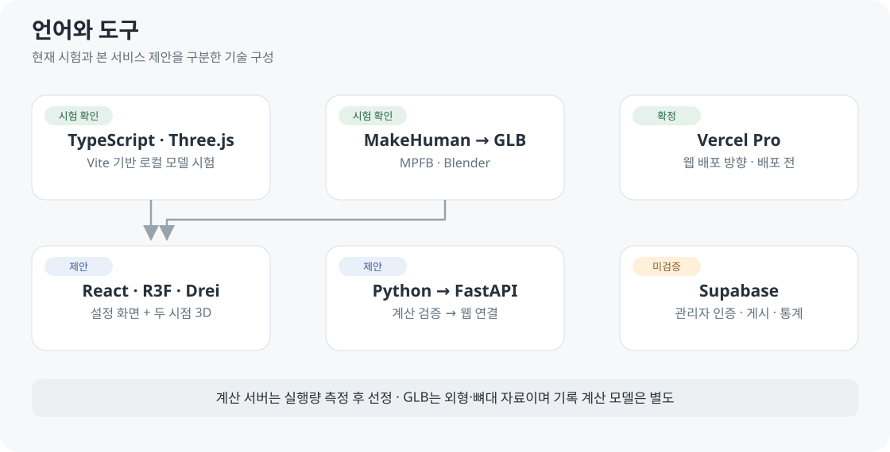
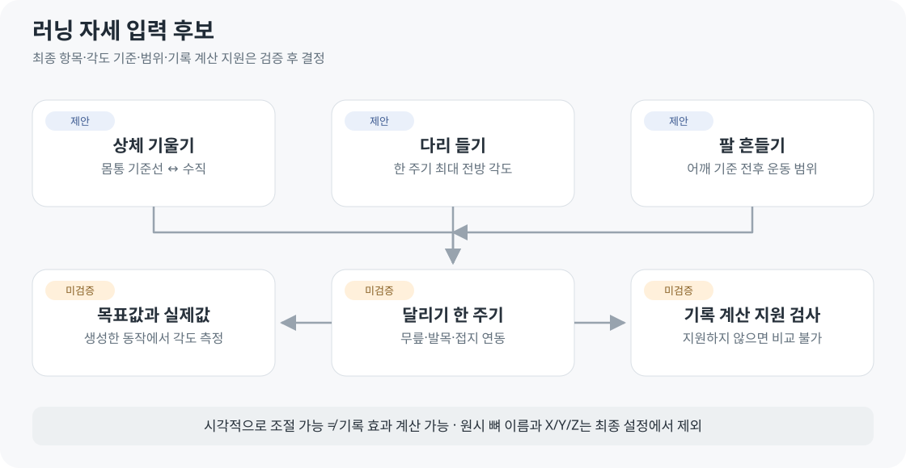

# 기술내역서

2026-10-04 · v0.4 설계안 · **웹 표시와 기록 계산을 분리합니다.**

## 현재 시험 환경 · 저장소 기준

| 항목 | 확인 값 | 근거 |
| --- | --- | --- |
| 언어 | TypeScript 7.0.2 | package.json 고정 의존성 |
| 3D | Three.js 0.186.1 · @types/three 0.186.0 | package.json |
| 개발·빌드 | Vite 8.3.2 | package.json |
| 런타임 | 시험 Node 24.19.0 · 선언 범위 ^20.19.0 또는 ≥22.12.0 | 시험 기록 · engines |
| 모델 제작 | Blender 5.2.2 LTS · MPFB 2.0.17 | 기존 변환·다운로드 기록 |
| 시험 저장 | localStorage · IndexedDB | 서버 DB 미연결 |

[패키지 원본](../../experiments/model-preview/package.json) · [잠금 파일](../../experiments/model-preview/package-lock.json) · [변환 안내](../06-guides/MODEL_PREVIEW.md). 최신 권장 버전 안내가 아닌 현재 프로젝트 내역입니다.

## 서비스 기술 선택·제안

| 영역 | 선택·제안 | 상태 |
| --- | --- | --- |
| 웹 | TypeScript · React · Vite · CSS Modules | 시험은 React 없는 TS·Vite·일반 CSS |
| 3D | Three.js · R3F · Drei View 또는 viewport 분할 | Three.js만 시험 확인 |
| 인체 | MakeHuman · MPFB · Blender → GLB | 선택 확정 · 전달 시험 확인 |
| 동작 | 사용자 자세 → 키프레임 → 보간·반복 | 검토 제안 · 저장/보간/접지 미구현 |
| 체형 | MPFB 변형 데이터 + 길이/뼈대 동시 변경 | 길이만 로컬 확인 · 외형과 조합 설계 전 |
| 경로 | 원본 좌표 → 미터 단위 JSON · QGIS 검토 | 실제 자료 미확보 |
| 계산 | Python · NumPy/SciPy/pandas → FastAPI | 제안 · 모델 검증 후 연결 |
| 배포 | 웹 Vercel Pro · 계산 서버 별도 선정 | 웹 미배포 · 계산량 측정 전 |
| 관리·통계 | Supabase Auth/DB/Storage · 서버 권한·수집 API | 운영 필수 · 미연결 · 개인 기록 저장은 후속 |
| 검사 | Git/GitHub · Vitest/Playwright · pytest | 전체 검사 체계는 구축 전 |

[R3F](https://r3f.docs.pmnd.rs/tutorials/how-it-works) · [Drei View](https://drei.docs.pmnd.rs/portals/view) · [Vercel Vite](https://vercel.com/docs/frameworks/frontend/vite) · [FastAPI](https://fastapi.tiangolo.com/features/)

로컬 관리자 시험은 TypeScript·IndexedDB(등록 GLB)·localStorage(설정/이벤트)를 사용합니다. 배포본에서는 이 관리·수집 기능을 차단하며 [운영용 관리자 연결](../03-screens/ADMIN_SCREEN.md)이 필요합니다.

## 편집 기술의 경계

프레임 저장·재생은 브라우저 우선 제안입니다. 보간 라이브러리·원본 체형의 웹 변환 방식은 하나의 실험으로 확인한 뒤 선택합니다.

| 현재 코드 | 후속 검토 |
| --- | --- |
| TS·Three.js의 직접 관절 조절 | 사용자 관절값을 프레임으로 저장 |
| 길이 변경 시 외형·뼈대 재계산 | 외형 변형과 길이 편집을 함께 적용 |
| 정적 자세 사용 통계 | 동작 전체의 사용 단위·버전 |

## 설정과 계산

| 입력·표시 | 내부 기준 |
| --- | --- |
| cm · mm · kg | m · kg · 측정점/변환 버전 |
| 도 | rad · 기준축/좌표계/회전 순서 |
| 분/km · km | m/s · m · s |
| 몸무게 | 질량과 외형 대응 분리 · 체력·근육량 자동 추정 없음 |
| 능력·노력 | 선정 모델의 변수·단위·보정 자료 필요 |

상체 기울기는 골반→상부 몸통과 수직의 각도라는 제안입니다. 몸 전체 기울기와 구분하고, 최종 기준축은 구현 전에 고정합니다.

## 구현 원칙

| 원칙 | 구현 조건 |
| --- | --- |
| 같은 자료로 계산·재생 | 생성 동작의 실제 각도·접지를 검사 |
| GLB와 계산 모델 분리 | 외형·뼈대를 근육·비용 모델로 취급하지 않음 |
| 지원 범위 선언 | 체형·자세·속도·경사·시간·출력 종류 명시 |
| 범위 밖 비교 차단 | 표시 가능한 자세라도 기록 효과 미지원 가능 |
| 도구 추가는 근거 확보 후 | 물리 엔진·OpenSim·AWS 자동 도입 없음 |

## 품질과 배포

| 항목 | 목표·남은 확인 |
| --- | --- |
| 개발 | 상대 경로·잠금 파일 · Windows 시험 / Mac 미검증 |
| Node | 시험 24.19.0 · 서비스 호환 LTS 버전 고정 예정 |
| 브라우저 | 데스크톱 Chromium 우선 · Safari/모바일 미검증 |
| 성능 | 1440×900 두 시점 60fps 목표 · 기준 PC·실측 미정 |
| 재현 | 입력·모델·자산·시드 고정 · 허용 오차 사전 결정 |
| 관측 | 실행 ID·시간·모델 버전·실패 단계 |
| 공개 전 | 전송량·계산량·저장량·요금 한도 확인 |
| 저장 도입 시 | 소유자별 권한 · 관리자 키는 서버에만 |

3D 렌더링은 브라우저가 담당합니다. 각도·접지·모델 오차와 응답시간 기준은 [D02–D08](../01-planning/DEVELOPMENT_PLAN.md)에서 결정합니다.

[접근 제어 근거](https://supabase.com/docs/guides/database/postgres/row-level-security) · [아키텍처](ARCHITECTURE.md) · [현재 시험 범위](../05-validation/CHARACTER_VALIDATION.md) · [동작 편집](../03-screens/MOTION_EDITOR.md) · [체형 처리](BODY_ASSETS.md)