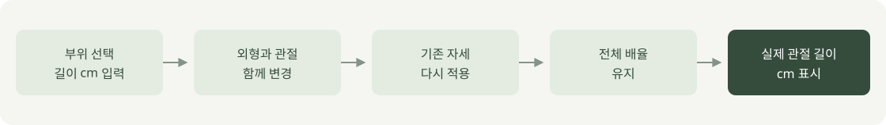
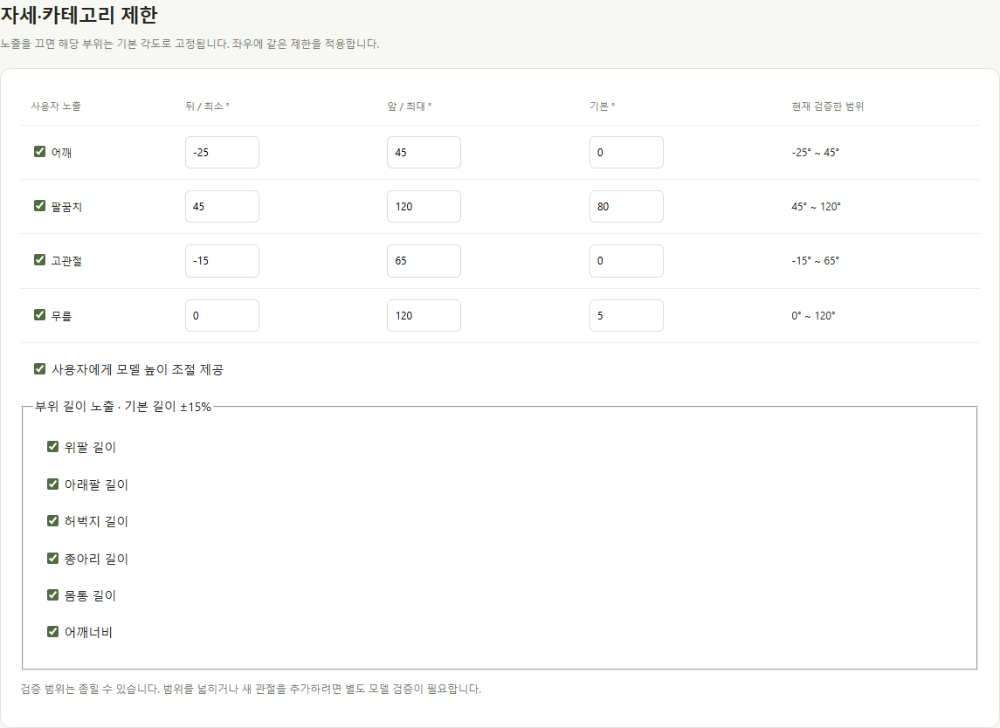

# 부위별 길이

2026-10-04 · **로컬 구현·수치 확인 완료 / 실측 신체 재현·달리기 검증 전**

부위를 선택해 cm로 입력합니다. 외형·관절 위치를 함께 바꾸고 기존 자세 각도는 유지합니다.

| 입력 · 좌우 함께 | cm 측정 기준 |
| --- | --- |
| 위팔 길이 | 어깨 관절 중심 → 팔꿈치 |
| 아래팔 길이 | 팔꿈치 → 손목 |
| 허벅지 길이 | 고관절 → 무릎 |
| 종아리 길이 | 무릎 → 발목 |
| 몸통 길이 | 골반 → 목 시작점의 관절 연결 길이 합 |
| 어깨너비 | 좌우 어깨 관절 중심 사이 |

기본 길이의 ±15%를 시험 범위로 제공합니다. 관절 중심 기준이므로 줄자로 잰 겉면 치수와 다릅니다.

| 조작 | 결과 |
| --- | --- |
| 한 부위 길이 변경 | 다른 부위 길이 유지 · 기준 자세 높이는 달라질 수 있음 |
| 전체 크기 변경 | 현재 비율을 유지하며 모든 길이에 같은 배율 적용 |
| 부위 길이 초기화 | 기본 비율로 복원 · 자세와 전체 배율 유지 |
| 전체 배율 초기화 | 부위별 설정 유지 · 전체 배율만 1배 |
| 범위 밖 숫자 / 빈 값 | 제한값 보정·안내 / 변경 거부 |
| 이 설정 적용 | 길이·모델·설정 버전·변형 방식 버전을 로컬 통계에 기록 |

관리자에서 6개 항목을 각각 숨길 수 있습니다. 숨긴 항목은 기본 길이 비율로 고정합니다.

| 검증 완료 · Edge | 남은 범위 |
| --- | --- |
| 남성형·여성형 × 6개 항목 × 최소/최대 | 모든 조합의 피부 품질·관통 검사 |
| 요청한 관절 길이·다른 길이 유지 | 실측 치수 대응·의학적 가동 범위 |
| 기존 자세·전체 배율 유지 · 원형 복원 | 복장·자동 달리기·접지 |
| 관리자 노출 제한 · 길이 기록 | 서버 저장·전체 사이트 통계 |

현재는 기본 외형을 늘리는 미리보기입니다. MakeHuman의 체형 재생성을 웹에서 실행하는 기능은 아닙니다.

[검사 수치](reports/body-dimensions-verification.json) · [캐릭터 설정](../03-screens/CUSTOMIZATION_SCREEN.md) · [관리자](../03-screens/ADMIN_SCREEN.md)

이미지: [촬영 스크립트](../../experiments/model-preview/scripts/capture-body-lengths.cjs)로 실제 로컬 화면 촬영. 흐름: 직접 작성한 [SVG 원본](../assets/diagrams/body-lengths.svg).

검사 재현: 개발 서버와 Playwright·Edge가 준비된 환경에서 저장소 루트의 `node experiments/model-preview/tests/body-dimensions.cjs` 실행. 별도 Playwright 경로는 `PLAYWRIGHT_PATH`로 지정합니다.
