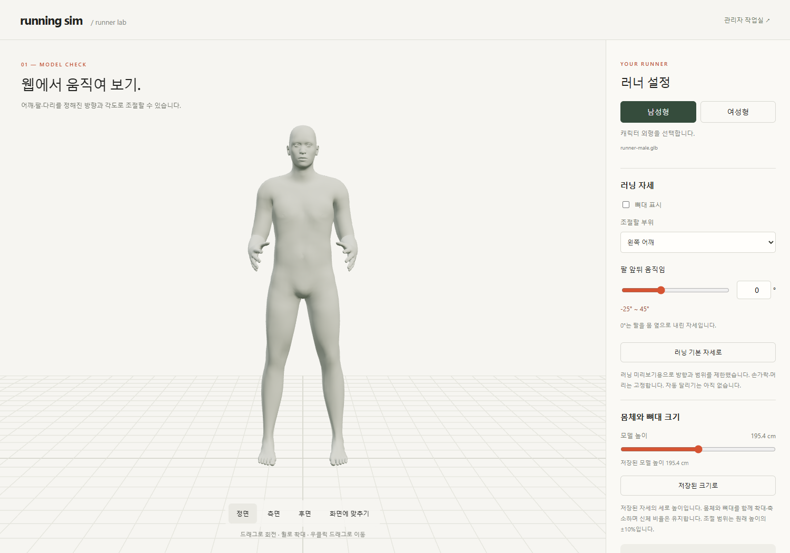
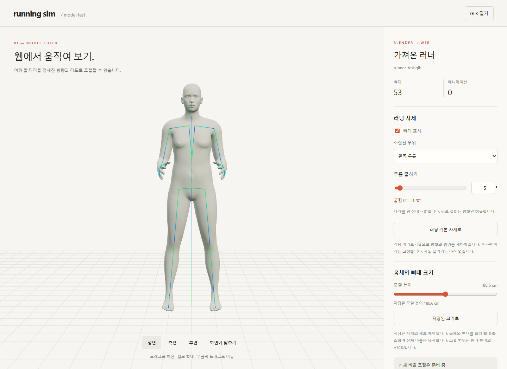
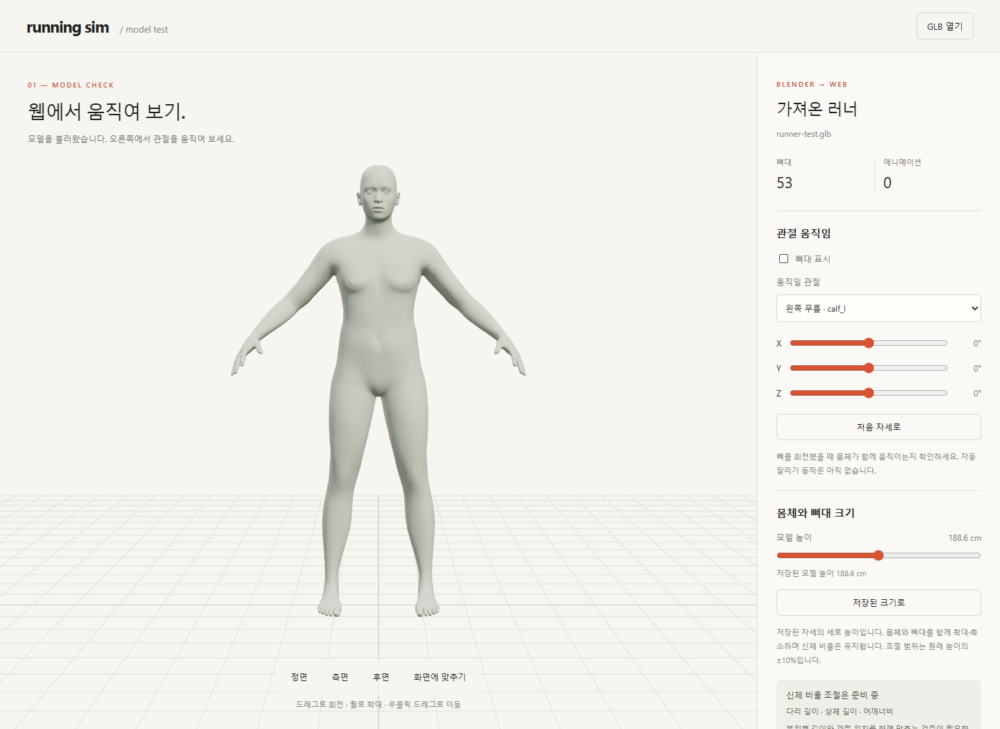

# 캐릭터 검증 기록

2026-10-04 · **웹 전달·기초 조작 확인 / 실제 치수와 달리기는 검증 전**

## 부위 길이·뼈대 동시 변경

남성형·여성형 6개 길이의 양 끝값 24건, 전체 최대 조합, 원형 복원, 자세·전체 배율 유지와 관리자 노출을 확인했습니다. [측정 기준](BODY_DIMENSIONS.md) · [검사 수치](reports/body-dimensions-verification.json)

## 남성형 여성형과 관리자 시험

두 모델의 외형·관절 위치가 서로 다르고, 각각 53개 뼈와 제한된 자세 입력이 동작함을 확인했습니다. 관리자 설정·모델 교체·통계·배포 차단 검사는 [관리자 검증 기록](reports/admin-lab-verification.json)에 남겼습니다.

## 러닝 자세 제한 검증

| 확인 | 결과 |
| --- | --- |
| 조절 부위 | 좌우 어깨·팔꿈치·고관절·무릎만 표시 |
| 방향 | 어깨/다리 앞뒤 · 팔꿈치 앞으로 굽힘 · 무릎 뒤로 굽힘 |
| 실제 각도 | 양 끝값·조합 등 23개 검사 · 최대 오차 0.000023° 미만 |
| 직접 입력 | 범위 제한·안내 · 빈 값 거부 · 기본 자세 복원 |
| 고정 부위 | 머리·목·손가락 등 나머지 관절의 자체 회전 유지 |
| 호환 | 높이 조절 시 각도 유지 · 미확인 GLB의 자세 조절 차단 |

앱의 미리보기 범위를 검사한 결과이며, 신체 충돌·접지·모든 자세의 인체 타당성까지 검증한 것은 아닙니다.

[입력별 각도 범위](../06-guides/MODEL_PREVIEW.md) · [검사 수치](reports/running-pose-verification.json)

## 이전 모델 높이 시험 화면

크기 조절 수정 당시의 시험 화면입니다. 원시 변형키를 제거하고 전체 높이(cm)를 몸체·뼈대에 함께 반영했습니다. 이 당시에는 부위별 조절을 지원하지 않았습니다. 현재 구현은 위의 부위 길이 검사 기록을 참고하세요.

## 모델 높이 수정 검증

| 검사 | 결과 |
| --- | --- |
| 저장 자세 높이 | 약 188.62 cm · 신체 실측값이 아닌 모델 경계 높이 |
| 최소/최대 조절 | 169.8 / 207.5 cm · 원래 높이의 ±10% 시험 범위 |
| 몸체·관절 | 몸체와 53개 관절이 같은 배율로 변경 · 발 높이 유지 |
| 관절·복원 | 양 끝 크기에서 무릎 변형·자세 복원 · 크기 복원 확인 |
| 파일 다시 열기 | 이전 크기 변경 제거 · 파일의 저장 크기로 복원 |

[높이·뼈대 검증 수치](reports/model-scale-verification.json) · [수정 전 시험 화면](../assets/images/model-preview-reference.png)

## 초기 전달 시험 기록

| 검사 | 결과·범위 |
| --- | --- |
| Blender | 사용자 체형 조절·리깅·관절 움직임·Refit 확인 |
| GLB | 약 4.28MB · 뼈 53개 · 변형키 12개 |
| Edge 표시 | 전신 · 보조 형상 제거 · 뼈대 표시/숨김 |
| 왼쪽 무릎 X 35° | 몸체 정점 이동 |
| 첫 변형키 0.9 | 외형 변형 |
| 자세·체형 복원 | 표본 정점 차이 ≤ 0.000001 |
| 개발 검사 | TypeScript 검사·배포용 빌드 통과 |

[검증 수치](reports/model-preview-verification.json) · [내보내기 기록과 해시](../../experiments/model-preview/public/models/runner-test.export.json) · [자산 출처](../07-references/makehuman-assets.json)

## 남은 범위

| 미검증·제약 | 확인할 것 |
| --- | --- |
| 내부 변형키 ≠ cm·kg | 입력/측정 치수 대응 |
| 부위별 길이 미리보기 구현 | 모든 조합의 피부 품질·실제 신체 치수 재현은 미검증 |
| 정점당 뼈 영향 최대 4개 | Blender와 변형 비교 |
| 무릎·첫 변형키만 시험 | 다른 관절·변형키·극단값·조합 |
| 피부·복장·달리기 없음 | 별도 자산·동작 검증 |
| Edge 로컬 시험 | Mac·모바일·성능 별도 검증 |

## 다음 검증

| 순서 | 산출물 |
| --- | --- |
| 1 기준 정의 | 키·부위 길이·어깨·발의 측정점 · 몸무게 외형 대응 · 허용 오차 |
| 2 단일 변경 | 기본·최소·중간·최대 입력 → 실측·차이·복원 |
| 3 조합 변경 | 키/다리 등 연관 항목 → 관통·틈새·관절·발 높이 |
| 4 웹 대조 | 같은 설정의 Blender/웹 앞·옆·뒤 이미지·측정값 |
| 5 범위 확정 | 가능 / 조건부 / 미지원 / 미검증 |
| 6 동작 검증 | 자세·접지·좌우 동기화·경로 이동 |

측정 기준과 허용 오차는 실험 전에 고정합니다. 몸무게 저장만으로 외형 조절 통과를 판정하지 않습니다.

[입력 후보](../03-screens/CUSTOMIZATION_SCREEN.md) · [개발 단계](../01-planning/DEVELOPMENT_PLAN.md) · [시험 실행](../06-guides/MODEL_PREVIEW.md)
