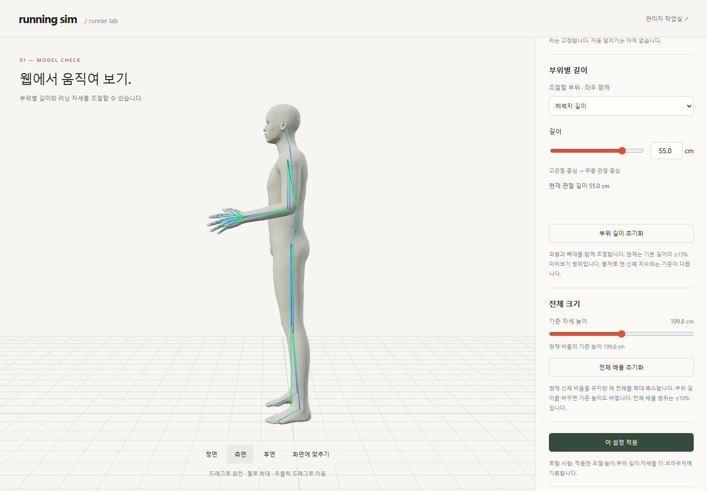
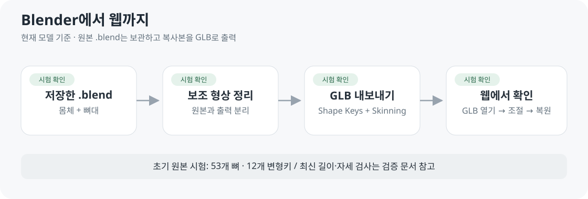

# 러너 모델 웹 시험

**저장한 모델의 외형·뼈대·변형 확인용** · TypeScript · Three.js · Vite



[사용자 화면](http://127.0.0.1:5173/) · [관리자 작업실](http://127.0.0.1:5173/admin) · [관리자 기능·통계 기준](../03-screens/ADMIN_SCREEN.md)

관리자 모델 테스트는 이용 통계에서 제외됩니다. 사용자 ‘이 설정 적용’만 자세·체형 사용 횟수로 기록하며 전체 사이트 통계는 아직 연결 전입니다.

위팔·아래팔·허벅지·종아리·몸통 길이와 어깨너비를 cm로 조절합니다. [측정 기준·조작 방법](../05-validation/BODY_DIMENSIONS.md)

## 러닝 자세 조절

| 좌우 각각 | 허용 동작 | 미리보기 제한 |
| --- | --- | --- |
| 어깨 | 팔 앞뒤 움직임 · 수직 아래가 0° | 뒤 25° ~ 앞 45° |
| 팔꿈치 | 앞으로 굽히기 · 편 팔이 0° | 45° ~ 120° |
| 고관절 | 다리 앞뒤 움직임 · 수직 아래가 0° | 뒤 15° ~ 앞 65° |
| 무릎 | 뒤로 굽히기 · 편 다리가 0° | 0° ~ 120° |

머리·목·손가락과 자유 X/Y/Z 회전은 제외합니다. 입력 각도는 관절 위치에서 측정하며 범위 밖 숫자는 제한값으로 보정해 안내합니다.

현재 GLB에 맞춘 미리보기 제한이며 모든 사람의 가동범위를 뜻하지 않습니다. 신체 간 충돌·지면 접촉·달리기 주기 검증은 후속입니다. 다른 GLB는 관절 대응을 확인하기 전 자세 조절을 비활성화합니다.

## 실행

Node.js 22.12 이상 · 이번 시험 24.19.0 · 이 PC의 기본 Node 16은 사용 불가.

```sh
cd experiments/model-preview
npm ci
npm run dev
```

표시된 로컬 주소를 엽니다. 이번 주소: http://127.0.0.1:5173/

| 모델 준비 | 방법 |
| --- | --- |
| 기본 파일 | public/models/runner-male.glb · runner-female.glb → 남성형/여성형 선택 |
| 다른 파일 | 관리자 → GLB 등록 → 표시 테스트 · 미확인 파일의 사용자 적용 금지 |
| 다른 PC | 원본·GLB는 Git 제외 → 별도 복사 |
| 검사·빌드 | npm run build |

## 시험 순서



| 순서 | 확인 |
| --- | --- |
| 1 보기 | 드래그·휠 · 앞/옆/뒤 |
| 2 관절 | 어깨·팔꿈치·고관절·무릎 선택 → 슬라이더 또는 각도 입력 |
| 3 복원 | 러닝 기본 자세로 · 어깨/고관절 0° · 팔꿈치 80° · 무릎 5° |
| 4 길이 | 부위 선택 → cm 입력 → 외형·관절 동시 변경 → 초기화 |
| 5 전체 크기 | 현재 신체 비율을 유지하며 전체 배율 조절 |

부위 길이는 기본 길이의 ±15%, 전체 크기는 현재 비율의 기준 높이 ±10%입니다. 자세 각도는 유지합니다. 실제 치수 재현·자동 달리기는 미검증입니다.

관리자에서 허용 범위를 좁히거나 카테고리를 숨길 수 있습니다. 위 표는 최초 기본값이며 새로 연 사용자 화면에 적용 설정을 반영합니다.

## Blender 자동 변환

남성형·여성형은 설치된 MPFB와 원본 .blend로 각각 생성합니다. 원본 저장 없이 체형 적용·뼈대 재맞춤 후 별도 GLB를 만듭니다.

```powershell
& 'B:/SteamLibrary/steamapps/common/Blender/blender.exe' --background --factory-startup --disable-autoexec --python-exit-code 1 --python 'experiments/model-preview/export_variants.py'
```

생성 파일은 public/models/runner-male.glb와 runner-female.glb입니다. 새 해시의 모델은 관절 검사 후 허용 프로필을 갱신해야 합니다. 기존 단일 시험 모델 변환은 아래 명령입니다.

프로젝트 루트에서 실행하는 Windows 예시입니다. 메뉴 방식은 [MPFB와 GLB 안내](MPFB_TO_GLB_GUIDE.md)를 참고하세요.

```powershell
& 'B:/SteamLibrary/steamapps/common/Blender/blender.exe' --background --factory-startup --disable-autoexec 'data/processed/makehuman/runner-test.blend' --python-exit-code 1 --python 'experiments/model-preview/export_runner.py'
```

| 조건 | 내용 |
| --- | --- |
| Blender | 이번 시험 5.2.2 LTS · 다른 PC는 실행 파일 경로 변경 |
| 입력 | data/processed/makehuman/runner-test.blend |
| 기준 OBJ | data/raw/makehuman/mpfb-2.0.17/data/3dobjs/base.obj 필요 |
| 구조 | Human + 연결 뼈대 · hm08 원본 정점/면 · 기본 자세 |
| 구조 불일치 | 잘못된 보조 형상 삭제를 피하도록 중단 |
| 출력 | public/models/runner-test.glb · 원본 .blend 저장 안 함 |
| 변환 | 보조 형상 제거 · 단색 재질 · 뼈/12개 변형키 유지 |
| 제약 | 뼈 영향 최대 4개 · 피부/복장/동작 추가 없음 |

## 확인 범위

| 확인 | 아직 검증 전 |
| --- | --- |
| Edge GLB 표시 · 무릎 · 첫 변형키 · 복원 | 전체 관절/변형키 · 실제 치수 |
| 남성형·여성형 부위 길이 6종 최소/최대 · 다른 길이 유지 · 자세·전체 배율·복원 | 모든 조합의 피부 품질·관통·실제 치수 대응 |
| 8개 자세 입력의 양 끝 각도·방향 · 제한·복원 · 높이 변경 호환 | 신체 충돌·접지·인체 타당성 전체 |
| TypeScript 검사 · 빌드 | Mac · 모바일 · 성능 · 달리기 |

[검증 결과](../05-validation/CHARACTER_VALIDATION.md) · [초기 전달 수치](../05-validation/reports/model-preview-verification.json) · [높이·뼈대 검사](../05-validation/reports/model-scale-verification.json) · [자세 제한 검사](../05-validation/reports/running-pose-verification.json) · [내보내기 기록](../../experiments/model-preview/public/models/runner-test.export.json) · [기술](../04-technical/TECH_SPEC.md) · [구조](../04-technical/ARCHITECTURE.md) · [개발 순서](../01-planning/DEVELOPMENT_PLAN.md)
