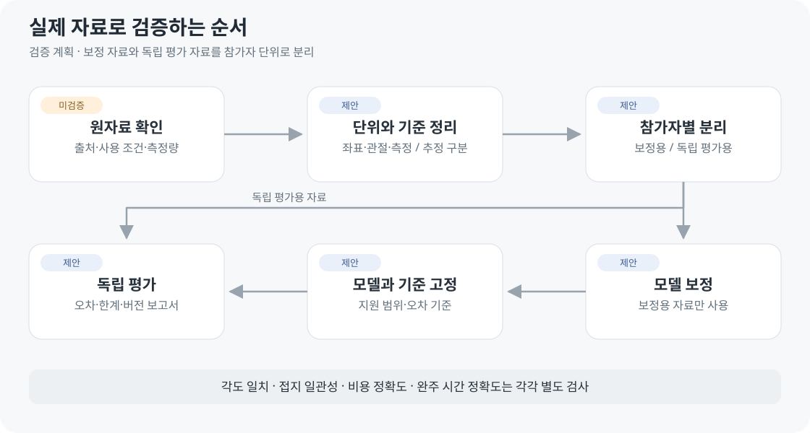

# 연구 자료와 확인 범위

2026-10-04 · **연구 후보 목록 · 데이터 파일 분석과 모델 검증은 아직 전**

## 자세와 기록 관련 후보

| 자료 | 확인한 설명 | 남은 확인 |
| --- | --- | --- |
| 11. [러닝 자세·속도·경사·케이던스 데이터](https://cris.maastrichtuniversity.nl/en/publications/dataset-of-running-kinematics-kinetics-and-muscle-activation-at-d/) · [논문](https://doi.org/10.1016/j.dib.2024.110312) | 19명 · 모션캡처·지면 반력·근전도 · OpenSim 처리 결과 | 실제 파일·라이선스 · 팔/다리 변수 · 비용/기록 연결 |
| 12. [전방 기울기와 러닝 경제성](https://pmc.ncbi.nlm.nih.gov/articles/PMC11135760/) · [출판사](https://doi.org/10.1371/journal.pone.0302249) | 몸통/발목 기울기 방식 · 동작·근활성·경제성 | 원자료·재현 · 속도/시간 범위 · 개인 오차 · 완주 시간 연결 |

11–12번은 공개 설명·연구 초록을 확인했습니다. OpenSim의 근육·관절 힘은 모델 추정값이며 직접 측정값과 구분합니다.

## 기존 후보

1–10번은 초기 전달 맥락을 보존한 목록입니다. 실제 파일·이용 조건은 별도 확인해야 합니다.

| 자료 | 활용 후보 | 확인할 한계 |
| --- | --- | --- |
| 1. [추가 다리 질량 2023](https://data.mendeley.com/datasets/b92bpvp4xd/1) | 동작·힘·호흡가스 | 첫 모델로 확정 안 함 · CC BY 4.0 전달 내용 재확인 |
| 2. [PhysioNet 트레드밀](https://physionet.org/content/treadmill-exercise-cardioresp/1.0.1/) | 속도·심박·호흡가스·신체 | 점증부하 검사 · 장거리 자료 아님 · 반복 참가자 식별 |
| 3. [Bath 탈진 달리기](https://researchdata.bath.ac.uk/1550/) | 동작·생리·분석 코드 | 실험 조건·시간·탈진 정의 |
| 4. [Smyth 2021](https://journals.plos.org/plosone/article?id=10.1371/journal.pone.0251513) | 마라톤 후반 감속 | 피로의 대리지표 · 통합 원자료 제공 미확인 |
| 5. [Emig와 Peltonen 2020](https://www.nature.com/articles/s41467-020-18737-6) | 개인 성능 모델 | Polar 원자료 비공개 · 맞춤/예측 오차 분리 |
| 6. [Minetti 2002](https://pubmed.ncbi.nlm.nih.gov/12183501/) | 경사별 에너지 비용 | 계산식·단위·속도/경사 범위·외삽 |
| 7. [Nazaret 2023](https://www.nature.com/articles/s41746-023-00926-4) · [코드](https://github.com/apple-aiml-research/ml-heart-rate-models) | 개인 심박 반응 | Apple 원자료 비공개 · 코드 라이선스·외부 검증 |
| 8. [OpenSim Moco 2020](https://journals.plos.org/ploscompbiol/article?id=10.1371/journal.pcbi.1008493) | 근골격 계산 방법론 | 프로젝트 적용·필요 입력 |
| 9. [Van Wouwe 2024](https://journals.plos.org/ploscompbiol/article?id=10.1371/journal.pcbi.1011410) | 체형·근육량·성능 | 가정·검증 범위·자세 비교 적용 |
| 10. [AnyBodyRun](https://www.anybodytech.com/webcasts/introduction-to-anybodyrun-a-web-application-for-running-biomechanics/) | 선행 서비스 | 소개만 확인 · 정확도/기능/이용 조건 미확정 |

## 자료별로 남길 기록

| 출처 | 이용 조건 | 재현 | 평가 |
| --- | --- | --- | --- |
| 확인일·읽은 범위 | 접근·라이선스 | 파일·단위·좌표·버전 | 보정/독립 자료·오차·한계 |

[계산 구조](../04-technical/ARCHITECTURE.md) · [모델 결정 D04–D07](../01-planning/DEVELOPMENT_PLAN.md)