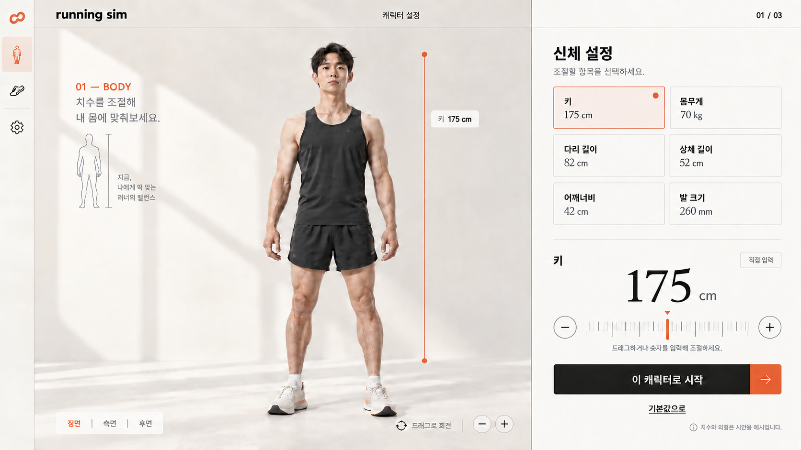

# 캐릭터 커스터마이징 화면정의서

작성일: 2026-10-02

사이트에 접속하면 캐릭터 설정부터 진행하고 게임 캐릭터 커스터마이징처럼 별도 화면을 제공한다는 사용자 요구를 반영한다. 기존의 주행 화면 안 설정 창을 첫 진입 경험으로 사용하는 안을 대체한다. 별도 화면 제공과 캐릭터 설정 우선 순서는 확정 요구이며, 아래 배치와 조작은 제안이다.

## 화면 이미지

최신 시안은 사용자 요청에 따라 큰 제목 “나의 러너.”를 제거하고, “치수를 조절해 내 몸에 맞춰보세요.” 안내를 “01 — BODY” 바로 아래에 왼쪽 정렬했다. 작은 사람 도식과 옆 설명도 안내 아래로 함께 올려 하나의 묶음으로 배치한다. 중앙의 전신 캐릭터 위치는 유지한다. [제목 제거 전 시안](images/character-customization-v4.png), [안내 이동 전 시안](images/character-customization-v5.png), [도식 이동 전 시안](images/character-customization-v6.png)은 보존한다.

사용자는 화면 구성은 대체로 맞으나 이전 세 시안의 디자인이 만족스럽지 않으며, 인스타처럼 감각적이고 현대적인 표현을 요청했다. 네 번째 시안은 넓은 전신 미리 보기, 비대칭 제목 배치와 따뜻한 중립색, 주황색 강조를 제안한다. 오른쪽에서는 여섯 항목을 한눈에 확인하고 선택한 항목을 큰 숫자와 눈금으로 집중 편집한다. 이 배치와 편집 방식은 새로운 제안이며 사용자 확정 전이다. [첫 시안](images/character-customization-v1.png), [두 번째 시안](images/character-customization-v2.png), [세 번째 시안](images/character-customization-v3.png)은 비교용으로 보존한다.

네 번째 시안의 집중 편집 방식에서는 길이 항목 선택 시 해당 값과 측정 위치를 강조한다. 다른 항목의 입력값은 유지한다. 몸무게 선택 시 외형 반영 검토 안내와 숫자 입력만 제공한다. 키의 눈금은 입력 조작 예시이며 실제 최소·최대 범위나 모델 치수 정확성을 보증하지 않는다. 아래 기본 정의의 동시 슬라이더 배치와 비교할 대안으로 검토한다. 이미지에 포함된 부가 문구나 아이콘은 새 기능 확정이 아니다.

내장 이미지 생성 도구로 제작한 정적 시안이다. 표시된 치수는 검증된 기본값이나 사용자의 치수가 아니다. 얼굴·복장·체형·부가 문구는 표현 예시이며 최종 확정 사양이 아니다. 이 그림이 실제로 치수 조절되는 3D 모델은 아니므로 [캐릭터 조절 검증](CHARACTER_VALIDATION.md)은 별도로 수행한다.

## 진입과 완료

첫 방문은 이 화면에서 시작한다. 경로 구성은 `/`에 커스터마이징, `/course`에 [코스 설정](COURSE_SCREEN.md), `/run`에 실행을 두는 안을 제안한다. 경로 이름은 구현 전 변경 가능하다. 확정한 캐릭터가 없는 상태에서 주행 주소로 바로 들어오면 설정 화면으로 안내한다.

기본 체형을 표시하지만 사용자가 확인하고 “이 캐릭터로 시작”을 눌러야 다음 화면으로 이동한다. 적어도 하나의 값을 바꾸도록 강요하지는 않는다. 자동 주행이나 건너뛰기 버튼은 두지 않는다. 계정 가입을 요구하지 않는다.

시작 버튼은 캐릭터 설정 완료를 뜻하며 달리기 시작을 뜻하지 않는다. 이후 별도의 코스 설정 화면에서 목표와 페이스를 설정하고 “달리기 시작”을 누른다. 이 문서의 주행 준비로 복귀한다는 표현은 코스 설정 화면으로 돌아오는 것을 의미한다.

## 배치와 구성

| 영역 | 내용 | 동작 |
| --- | --- | --- |
| 상단 | 캐릭터 설정 → 달리기 준비 → 시뮬레이션 단계 | 현재 단계 강조, 아직 진행할 수 없는 단계는 이동 불가 |
| 왼쪽 약 65% | 정지한 사람형 전신 캐릭터와 간단한 바닥 | 입력한 체형 미리 보기 |
| 미리 보기 아래 | 정면·측면·후면, 시점 초기화 | 드래그 회전을 보완하며 키보드로도 선택 가능 |
| 오른쪽 약 35% | 기본 신체와 신체 비율 입력 | 길이는 숫자와 슬라이더, 몸무게는 숫자 입력 |
| 하단 왼쪽 | 기본 체형으로 | 체형 초안을 기본값으로 초기화 |
| 하단 오른쪽 | 이 캐릭터로 시작 | 유효한 체형을 확정하고 주행 준비로 이동 |

캐릭터는 머리부터 발끝까지 보이게 유지한다. 회전은 미리 보기 영역에서만 적용한다. 숫자 입력과 슬라이더의 값은 동일해야 한다. 선택한 신체 부위의 측정 기준을 설명하고 필요하면 모델에 기준점을 표시한다. 드래그로 모델 자체를 변형하는 조작은 첫 제안에 포함하지 않는다.

캐릭터가 커지거나 작아질 때 카메라의 자동 조정만으로 변화가 상쇄되지 않도록 바닥 기준과 높이 눈금 등을 함께 보여주는 방안을 검증한다. 모델이 잘리거나 화면 밖으로 나가지는 않게 한다.

## 설정 항목과 검증

키 cm, 몸무게 kg, 다리 길이 cm, 상체 길이 cm, 어깨너비 cm, 발 크기 mm를 다룬다. 키와 몸무게는 기본 신체, 나머지는 신체 비율로 묶는다. 기본값·최솟값·최댓값과 측정점은 모델 검증 후 확정한다. 시안의 숫자를 구현 기본값으로 그대로 사용하지 않는다.

유효한 값은 즉시 미리 보기에 반영한다. 입력 도중 빈칸이나 잘못된 값은 마지막 유효 외형을 유지하고 필드 옆에 오류를 안내한다. 키와 부위 길이의 조합이 충돌하면 이유를 표시하고 다음 화면으로 넘어가지 못하게 한다. 다른 값을 몰래 바꾸지 않는다.

몸무게는 외형 대응 방식이 미확정이다. 단순히 입력이 가능하다는 이유로 몸무게에 정확히 맞는 외형을 생성한다고 주장하지 않는다. 첫 검증 결과에 따라 지원 방식과 안내를 확정한다. 근골격 특성은 모델과 계산 정의가 확보된 뒤 추가한다.

게임과 같은 커스터마이징이라는 요구는 캐릭터를 보면서 직접 조절하는 경험으로 반영한다. 얼굴·머리·피부색·복장 선택까지 자동으로 범위에 포함하지 않는다.

## 입력 상태와 돌아오기

| 상태 또는 행동 | 규칙 |
| --- | --- |
| 모델 로딩 중 | 준비 문구 표시, 다음 단계 비활성화 |
| 로딩 실패 | 오류와 재시도 표시, 입력 초안 유지 |
| 정상 편집 | 외형 미리 보기, 유효한 경우 다음 단계 활성화 |
| 입력 오류 | 해당 필드 안내, 다음 단계 비활성화 이유 표시 |
| 설정 완료 | 캐릭터 설정과 모델 버전을 세션에 보관하고 주행 준비로 이동 |
| 주행 준비에서 캐릭터 수정 | 확정한 값으로 이 화면을 다시 열고 목표·페이스 유지 |
| 주행 중 캐릭터 수정 | 먼저 현재 달리기 종료 확인, 확정 시 중도 종료 요약 유지 후 이동 |
| 수정 취소 | 최초 설정 때는 제공하지 않음. 재편집 때는 기존 확정값을 유지하고 주행 준비로 복귀 |
| 재편집 적용 | 새 체형을 확정하고 주행 준비로 복귀, 자동 재시작하지 않음 |

확정된 체형과 편집 중인 초안을 구분한다. 재편집 화면의 기본값 초기화도 확정 전에는 기존 캐릭터에 반영하지 않는다. 첫 버전은 새로고침 후 복구를 보장하지 않으며 새 세션에서는 설정 화면부터 시작한다. Supabase를 이용한 캐릭터 영구 저장은 별도 후속 범위다.

## 완료 기준

- 첫 접속에 트랙보다 캐릭터 설정 화면이 먼저 보인다.
- 입력한 치수의 변화가 전신 모델에 보이고, 실측 비교로 지원 범위가 검증되어 있다.
- 앞·옆·뒤에서 체형과 관절을 확인할 수 있다.
- 잘못된 치수와 불가능한 조합을 설명 없이 통과시키지 않는다.
- 캐릭터를 확정하면 주행 준비의 좌우 화면에 같은 설정이 적용된다.
- 설정 완료만으로 달리기가 시작되지 않는다.
- 다시 수정하거나 취소했을 때 체형과 주행 조건의 유지 규칙이 일관된다.

## 관련 문서

- [전체 화면정의서](SCREEN_SPEC.md)
- [서비스 기획서](SERVICE_PLAN.md)
- [캐릭터 조절 검증 계획](CHARACTER_VALIDATION.md)
