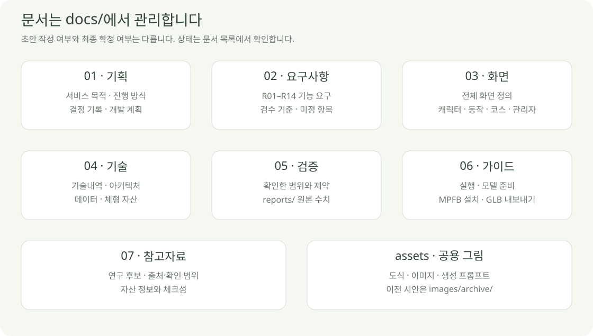

# 프로젝트 문서

2026-10-04 · **작성된 초안과 검토·구현 완료를 구분합니다.**

## 주요 문서 작성 상태

| 문서 | 작성 | 남은 검토 |
| --- | --- | --- |
| [서비스 기획서](01-planning/SERVICE_PLAN.md) | 초안 작성 | 사용자 동작 제작의 세부 범위 |
| [요구사항 명세서](02-requirements/REQUIREMENTS.md) | 독립 문서 작성 | R12–R14 범위 · 품질 목표·허용 오차 |
| [화면 정의서](03-screens/SCREEN_SPEC.md) | 전체/상세 초안 작성 | 동작 편집·저장·실패 상태의 최종 UX |
| [기술내역서](04-technical/TECH_SPEC.md) | 초안·현재 버전 정리 | React 전환·보간·계산 모델·호스팅 |
| [아키텍처 설계서](04-technical/ARCHITECTURE.md) | 구조 초안 작성 | 운영 연결·실행 엔진 상세 |
| [데이터 설계서](04-technical/DATA_DESIGN.md) | 계약 초안 작성 | 서버 스키마·프레임 보관·권한 |
| [개발 계획서](01-planning/DEVELOPMENT_PLAN.md) | 단계·작업 후보 정리 | 다음 작은 작업 선택 |
| [검증 기록](05-validation/CHARACTER_VALIDATION.md) | 기존 시험 기록 정리 | 서비스 전체·새 기능 검증 |

API 상세 명세, 실제 DB 테이블, 운영/배포 절차, 기록 계산식은 아직 확정하지 않았습니다. 없는 내용을 완료된 문서로 표시하지 않습니다.

## 상세 문서

| 폴더 | 문서 |
| --- | --- |
| `01-planning/` | [서비스 기획](01-planning/SERVICE_PLAN.md) · [결정 기록](01-planning/PROJECT.md) · [협업 방식](01-planning/WORKFLOW.md) · [개발 계획](01-planning/DEVELOPMENT_PLAN.md) |
| `02-requirements/` | [요구사항 명세](02-requirements/REQUIREMENTS.md) · 요구·검수 기준의 기준 문서 |
| `03-screens/` | [전체 화면](03-screens/SCREEN_SPEC.md) · [캐릭터](03-screens/CUSTOMIZATION_SCREEN.md) · [동작 편집](03-screens/MOTION_EDITOR.md) · [코스](03-screens/COURSE_SCREEN.md) · [관리자](03-screens/ADMIN_SCREEN.md) |
| `04-technical/` | [기술내역](04-technical/TECH_SPEC.md) · [아키텍처](04-technical/ARCHITECTURE.md) · [데이터](04-technical/DATA_DESIGN.md) · [체형 자산](04-technical/BODY_ASSETS.md) |
| `05-validation/` | [캐릭터 검증](05-validation/CHARACTER_VALIDATION.md) · [길이 조절](05-validation/BODY_DIMENSIONS.md) · [검사 수치 폴더](05-validation/reports/) |
| `06-guides/` | [로컬 실행·모델 시험](06-guides/MODEL_PREVIEW.md) · [MPFB·GLB](06-guides/MPFB_TO_GLB_GUIDE.md) |
| `07-references/` | [연구 자료](07-references/REFERENCES.md) · [자산 출처](07-references/makehuman-assets.json) |
| `assets/` | [그림 원본·생성 방식](assets/README.md) · diagrams / images / prompts |

## 관리 규칙

- 문서는 위 폴더에 분류하고 `docs/` 바로 아래에는 이 목록만 둡니다.
- 요구사항은 명세서, 화면 동작은 화면 정의서에 기록하고 다른 문서에서 연결합니다.
- 최신 시안·캡처는 `assets/images/`, 이전 디자인 시안은 `assets/images/archive/`에 보관합니다.
- 기능 코드·모델·임시 결과는 문서 폴더에 넣지 않습니다. 검사 수치 JSON은 `05-validation/reports/`에 둡니다.
- 새 문서를 추가하거나 옮기면 이 목록·상대 링크·그림을 함께 갱신합니다.

[프로젝트 시작점](../README.md)
